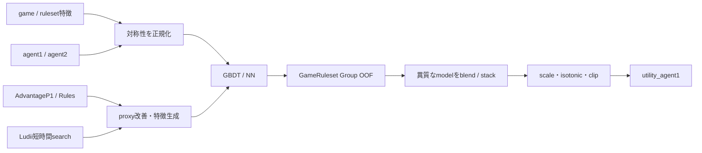
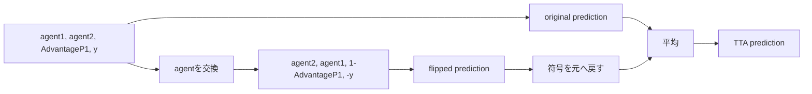

# UM - Game-Playing Strength of MCTS Variants 上位解法まとめ — 「モデル選び」より先に対戦の対称性と予測の縮みを直す

## はじめに

多数のボードゲームについて、2つのMCTS設定を戦わせたときの勝敗を予測する[UM - Game-Playing Strength of MCTS Variants](https://www.kaggle.com/competitions/um-game-playing-strength-of-mcts-variants)が、2024年12月2日まで開催されていました。

上位解法ではCatBoost、LightGBM、XGBoost、TabM、MLP、DeBERTaと幅広いモデルが使われました。しかし最終1〜13位のSolutionを横断すると、順位を決めた中心はモデル名ではありません。

> **agent1とagent2を交換しても同じ対戦を逆側から見ているだけ、という対称性を正しく使い、最重要proxyのnoiseとRMSE予測の0への縮みを別々に直す。**

この3点を、未知gameへ外挿するGroup CVの上で壊さず組み合わせることが上位の共通骨格でした。

この記事では、一次Solutionを取得できた最終1〜13位の全13チームを、順位順ではなく実際の問題解決順に整理します。各手法の厳密な再現条件は、リンク先のSolutionもあわせて確認してください。

## コンペ概要

### タスク

1行は、あるLudii game/ruleset上で2つのMCTS agent設定を対戦させた結果を表します。入力にはgameの構造、random simulationの統計、自然言語・形式言語ルール、agent1/agent2の構成などが含まれます。

予測対象の`utility_agent1`は、概ね`(agent1の勝数 - agent1の敗数) / 試合数`で、範囲は-1〜1です。評価指標はRMSEなので、符号を間違えた大外しと、極端な勝敗を0へ縮めすぎる予測の両方が強く罰せられます。

testは約60,000行で、Evaluation APIが100行ずつ渡します。各batchは10分以内、Notebook全体はCPU/GPUとも9時間以内、internetなしという制約でした。

### 提供データ

| データ | 内容 | 解法上の役割 |
|---|---|---|
| game/ruleset特徴 | 盤面、駒、move、randomnessなど800列超 | tabular modelの主入力。ただしconstant・相関・noisy列が多い |
| `GameRulesetName` | game名とruleset名の組 | 未知ruleset汎化を測るGroupKFoldの単位 |
| `agent1` / `agent2` | selection、exploration、playoutなどを含むMCTS設定文字列 | 分解category、interaction、順序対称性の基礎 |
| `AdvantageP1` | random playから推定した先手有利度 | targetと強く相関する最重要proxyだがnoiseを含む |
| `LudRules` / `EnglishRules` | 完全な形式ルール／自然言語説明 | text特徴、ruleset clustering、proxy再推定 |
| `utility_agent1` | agent1側から見た対戦utility | flip時に符号反転が必要なtarget |

### このコンペが難しい理由

- testにはtrainで十分観測されていないgame/rulesetがあり、行をrandom splitすると過度に楽観的になる
- agent1とagent2は順序付きだが、本質的には同じ対戦を反対側から見た対称関係を持つ
- `AdvantageP1`は強力でもrandom play由来で、対象MCTS同士の本当の均衡度とは一致しない
- gameごとの行数、試合数、target分散が異なり、fold間varianceが大きい
- RMSE回帰は極端なutilityを0へ縮めやすく、単体modelの順位と校正後の順位が変わる
- Public/Privateで共有rulesetや分布があり、CVとLeaderboardのどちらを信じるかが難しかった
- engine simulation、text model、多数foldを積むとEvaluation APIと9時間制約に接近する

## 上位解法の全体像

上位チームの差は、主に次の5点にありました。

1. flipを学習augmentation、別model、TTAのどこへ入れたか
2. `AdvantageP1`をそのまま使わず、どう安定化・再推定したか
3. 未知gameを想定したCVとPublic LBの矛盾をどう扱ったか
4. model familyではなく、どのdata/feature viewで多様性を作ったか
5. 0へ縮んだ予測を、どの情報だけで校正したか

## 1. まず対戦順序の対称性を正しく使う

### flipは単なる行の複製ではない

agent1とagent2を交換した行は、別の試合ではなく同じ対戦を反対側から表したものです。したがってtargetと先手有利も整合させる必要があります。

[10位 DO THE HARLEM SHAKE](https://www.kaggle.com/competitions/um-game-playing-strength-of-mcts-variants/discussion/549605)は公開CatBoostへflipを追加し、Public RMSEを0.427から0.422へ改善しました。[7位 gezi](https://www.kaggle.com/competitions/um-game-playing-strength-of-mcts-variants/discussion/549617)もPublicで約0.01の改善を報告しています。

[5位 dümensemble](https://www.kaggle.com/competitions/um-game-playing-strength-of-mcts-variants/discussion/549585)では、元行とflip行を同じmodelへ入れるだけでなく、元data中心のpipelineと別viewのpipelineをblendしました。[3位 senkin13](https://www.kaggle.com/competitions/um-game-playing-strength-of-mcts-variants/discussion/549588)はflipを使った第1段modelのOOF予測を第2段へ渡し、対称性から得たsignalをstacking特徴へ変えています。

### 関連特徴を反転しないと対称性が壊れる

[6位 Vadim Timakin](https://www.kaggle.com/competitions/um-game-playing-strength-of-mcts-variants/discussion/549582)はtargetと`AdvantageP1`だけでなく`Balance`も反転しました。これにより元行と拡張行のOOF gapが縮まりました。augmentationの名前が同じでも、変換対象の定義が違えば学習している問題も違います。

[13位 G&G](https://www.kaggle.com/competitions/um-game-playing-strength-of-mcts-variants/discussion/549781)は全gameを機械的にflipせず、対称gameだけへ適用しました。順序交換が理論上または生成過程上成立する範囲を決めることが先です。

### 学習時flipとTTAは分けて検証する

対称性が正しくても、拡張行の比率がtrain分布を変えることがあります。[9位 No Overfitting, Just Skills](https://www.kaggle.com/competitions/um-game-playing-strength-of-mcts-variants/discussion/549624)では、学習augmentationがCVを0.405から0.395へ大きく改善した一方、Publicは0.416から0.421へ悪化しました。最終的には元dataだけで学習し、flip TTAだけを残しています。

この反例から、対称性augmentationは次の3条件を分離すべきだと分かります。

1. 元dataだけで学習
2. 元dataとflipを混ぜて学習
3. 元data学習modelへflip TTAのみ追加

理論的に正しい変換でも、samplingとvalidationの設計まで自動的に正しくなるわけではありません。

## 2. 最重要proxyを「使う」から「測り直す」へ進める

### `AdvantageP1`は強いが、目的と完全には一致しない

`AdvantageP1`はrandom agentから推定した先手有利度です。targetは特定のMCTS構成同士のutilityなので、両者には構造的なずれがあります。上位チームは重要度の高い列としてそのまま信頼せず、noiseを減らすか別の量へ変換しました。

[10位](https://www.kaggle.com/competitions/um-game-playing-strength-of-mcts-variants/discussion/549605)は`AdvantageP1`を10-bin化し、Publicを0.422から0.420へ改善しました。連続値の細かなnoiseを捨て、先手有利の大まかな状態として扱った形です。

[9位](https://www.kaggle.com/competitions/um-game-playing-strength-of-mcts-variants/discussion/549624)は`utility - AdvantageP1`のような残差viewと変形`AdvantageP1`を別modelへ入れました。[13位](https://www.kaggle.com/competitions/um-game-playing-strength-of-mcts-variants/discussion/549781)は上位game特徴との積・商を作り、先手有利がどのgame条件で強く現れるかをtreeへ明示しました。

### 形式ルールからproxyを再推定する

[12位 DeadKey](https://www.kaggle.com/competitions/um-game-playing-strength-of-mcts-variants/discussion/550400)は`LudRules`をDeBERTaで読み、random MCTS間の結果を予測してからLightGBMで補正しました。Q&Aでは、OOF予測、agent label encoding、agent pairによる層化が大きく効いたと説明しています。

これはtext分類を追加したのではなく、最重要proxyの生成過程を別modelで近似し直した点が本質です。text embedding自体が目的ではなく、既存tabular特徴が落としているgame ruleの情報を`AdvantageP1`へ戻しています。

### 1位は実際にgameを短時間動かした

[1位 James Day](https://www.kaggle.com/competitions/um-game-playing-strength-of-mcts-variants/discussion/549801)はLudii上の初期局面を約15秒searchし、より実際のgame balanceに近い特徴と探索速度を作りました。初期のLeaderboardで約0.012という大きな改善を報告しており、最終的な独自signalの中心でした。

さらにGAVELとLLMを使って484 ruleset・14,365行を追加し、元dataと同等に扱わずsample weightでnoiseを制御しました。量を増やすことより、何を測り直した行なのか、どの程度信頼するかを分けた点が重要です。

## 3. 特徴量は「重要列の周辺」を掘る

### agent文字列を構成要素へ分ける

`MCTS-<SELECTION>-<EXPLORATION_CONST>-<PLAYOUT>-<SCORE_BOUNDS>`のようなagent文字列を丸ごとcategoryにすると、構成要素間の共有が見えません。上位ではselection、playout、explorationなどへ分解し、agent間interactionやgame特徴との関係を学ばせる方法が共通していました。

[2位 Richard_U](https://www.kaggle.com/competitions/um-game-playing-strength-of-mcts-variants/discussion/549718)はTF-IDFとKMeansでrulesetをcluster化し、複数のGBDT/NNへ異なる表現を渡しました。一方で複雑なFEそのものより、flipと大規模なmodel diversityへ比重を置いています。

### 全組合せではなく、候補選択器まで検証する

[7位](https://www.kaggle.com/competitions/um-game-playing-strength-of-mcts-variants/discussion/549617)はLightGBM importance上位20数値特徴の積・商を作り、LGBを主力へ引き上げました。しかし25×25へ広げると悪化し、CatBoost importanceで選んだ上位20でも悪化しました。

「interactionが効いた」ではなく、候補をどのmodelのimportanceで選び、何個まで組み合わせたかが一体のhyperparameterです。表形式dataで列を増やすときは、feature generatorだけでなくselectorの種類と上限を固定して比較する必要があります。

### textと大量追加dataは安定した勝ち筋ではなかった

[11位 Kansai-kaggler](https://www.kaggle.com/competitions/um-game-playing-strength-of-mcts-variants/discussion/549708)はrule sectionごとのTF-IDF、追加生成data、multi-targetなど異なるviewをteam内で作りました。30k〜40kの外部行はCVを改善してもLeaderboardへ移らず、rule text modelも単独では主力になりませんでした。

textや追加dataが無効なのではありません。group境界を越えて一般化する新しいsignalなのか、既知rulesetの識別子を精密化しているだけなのかを、未知group holdoutで分ける必要があります。

## 4. 強い単体より、誤差の発生源が違うmodelを作る

### CatBoostは標準、差は二本目の作り方

CatBoostはcategoryと非線形interactionを安定して扱え、多くの上位解法の中心でした。しかしCatBoostのseedやfoldだけを増やしても、同じ場所で外すmodelが増えるだけです。

| 多様性の軸 | 代表例 | 異なる誤差を作る理由 |
|---|---|---|
| tree family | LightGBM Dart、XGBoost `lossguide` | tree growthとsubsamplingが異なる |
| representation | TabM、MLP、DeepTables | category・数値interactionの学び方が異なる |
| data view | original / flip / residual target | 同じ行を別の対称性・targetで見る |
| feature view | engine search、rule text、interaction | 既存列と別の情報源を使う |
| validation view | ruleset / game / stratified group | 外挿失敗の現れ方が異なる |

[1位](https://www.kaggle.com/competitions/um-game-playing-strength-of-mcts-variants/discussion/549801)はCatBoost、LightGBM Dart、TabMを組み合わせました。TabMはtree由来特徴なしでもLightGBM級となり、piecewise-linear embeddingが異質な枝になりました。

[13位](https://www.kaggle.com/competitions/um-game-playing-strength-of-mcts-variants/discussion/549781)はXGBoostを`grow_policy='lossguide'`、深いtree、強いcolumn subsamplingで成立させ、3系統×10-foldの予測を結合しました。XGBoostを足したのではなく、広い表で重要signalを毎tree異なる列集合から拾わせています。

### stackingはOOFの作り方がmodel本体

[3位](https://www.kaggle.com/competitions/um-game-playing-strength-of-mcts-variants/discussion/549588)は第1段階のfold外予測だけを第2段へ渡しました。[6位](https://www.kaggle.com/competitions/um-game-playing-strength-of-mcts-variants/discussion/549582)はさらにnested CVでCatBoost OOFをLightGBM/DNNへ渡し、meta-modelが自分を学習した予測を見ないようにしています。

[11位](https://www.kaggle.com/competitions/um-game-playing-strength-of-mcts-variants/discussion/549708)は16候補からfoldごとにOptunaでsubsetを選び、Nelder–Meadで重みを最適化しました。CVは0.3912まで伸びた一方Privateは0.42490で、varianceの大きいfoldへmeta-selectionを重ねる危険も示しました。

## 5. CVは順位表ではなく、未知gameの故障診断にする

### GroupKFoldでもgroup定義で結論が変わる

標準は`GameRulesetName`によるGroupKFoldでした。同じrulesetの行をtrain/validationへ跨がせず、未知rulesetへの外挿を測るためです。しかしgame単位、試合数層化、target層化などでmodel順位が変わりました。

[7位](https://www.kaggle.com/competitions/um-game-playing-strength-of-mcts-variants/discussion/549617)はGame GKFとruleset GKFの結論が揺れ、競技後にmodel選択を誤った可能性を認めています。[11位](https://www.kaggle.com/competitions/um-game-playing-strength-of-mcts-variants/discussion/549708)ではfold別CVが0.3677〜0.40944と大きくばらつきました。平均RMSEだけでは、どのgame群に依存した改善かが見えません。

最低限、次を並べて見る必要があります。

- fold平均とstandard deviation
- worst fold
- game/ruleset別のresidual
- `AdvantageP1`帯、agent pair、観測数別の誤差
- model間OOF correlation

### Trust CVとTrust LBの両方が成功した

[1位](https://www.kaggle.com/competitions/um-game-playing-strength-of-mcts-variants/discussion/549801)は複数seed CVを信頼するpipelineとPublic LBを信頼するpipelineを並走させ、最終的にはTrust CV側がPublic/Privateとも勝ちました。

一方、[4位 Manuel Campos](https://www.kaggle.com/competitions/um-game-playing-strength-of-mcts-variants/discussion/549603)は11個の公開Notebook予測をPublic LBへcascade状にfitし、最後に1.25倍とclipを加えてPrivate 4位でした。CV型stackingは約20位相当で、Publicから得たresidual情報を使う方が成功しています。

[2位](https://www.kaggle.com/competitions/um-game-playing-strength-of-mcts-variants/discussion/549718)も4 GBDTと3 NN、複数seed setをOLSで結合し、負重みを許したPublic-fit版がCV版を上回りました。終了後にPublic/Privateへ一部同じrulesetが含まれたことが説明されており、この成功を一般的な「LBを信じるべき」という教訓にはできません。

重要なのはCVかLBかを信仰で選ぶことではなく、test splitの生成仮説を2つ用意し、最終2枠を異なるfailure modeへ割り当てることです。

## 6. RMSE予測の0への縮みを最後に直す

### 強い回帰modelでも分布が狭くなる

正則化されたtree/NNの予測は、targetの±1に比べて0へ縮みます。RMSEでは順位だけでなく振幅が必要なため、校正が独立した改善軸になりました。

上位では次の方法が使われています。

- 固定scale：1.12〜1.3倍
- 線形補正：`a * prediction + b`
- ensemble重みの合計を1より大きくする
- isotonic regression
- `[-0.98, 0.98]`付近へのclip

[3位](https://www.kaggle.com/competitions/um-game-playing-strength-of-mcts-variants/discussion/549588)はLeaderboard probingから1.12倍、[8位 Kohei](https://www.kaggle.com/competitions/um-game-playing-strength-of-mcts-variants/discussion/549616)は1.2倍、[10位](https://www.kaggle.com/competitions/um-game-playing-strength-of-mcts-variants/discussion/549605)は1.25倍を採用しました。

[13位](https://www.kaggle.com/competitions/um-game-playing-strength-of-mcts-variants/discussion/549781)の非負線形重みは3系統とも合計約1.16〜1.18で、ensembleとscale補正を同時に行っています。[1位](https://www.kaggle.com/competitions/um-game-playing-strength-of-mcts-variants/discussion/549801)は固定scaleよりOOFでfitしたisotonic regressionの方がCVとLeaderboardの相関に優れたと報告しています。

校正をPublic scoreで選ぶと、model選択と振幅選択を同じ小さなsampleへ二重にfitします。まずOOFだけでidentity、linear、isotonicを比較し、clip境界も外側foldで評価する方が移植しやすい設計です。

## 7. iteration速度を特徴量探索へ変える

[8位](https://www.kaggle.com/competitions/um-game-playing-strength-of-mcts-variants/discussion/549616)は公開baselineの前処理をpolarsへ置き換え、410秒から7秒へ短縮しました。10日間という短期参加で、浮いた時間を盤面・駒・randomness・rule complexityの特徴量試行へ回しています。

[13位](https://www.kaggle.com/competitions/um-game-playing-strength-of-mcts-variants/discussion/549781)はCPU LightGBMで広く探索し、有望なXGBoost/CatBoostだけへGPU quotaを使いました。computeの使い分け自体がsearch policyです。

ただし高速化で実験数が増えても、複数軸を同時に変えると何が効いたか分かりません。8位自身もFEとparameterを同時変更し、寄与を管理しきれなかったと振り返っています。iteration速度は、1変更1仮説を守ったときに初めてGoldへの試行回数へ変わります。

## 上位解法から見えた、特に重要な発見

### 1. 対称性はaugmentation手法ではなく、data contractである

agent交換、target符号、先手有利、Balanceを一つの変換として定義しなければ、行数だけを増やして矛盾した教師を作ります。学習flipとTTAを分けた9位の反例まで含めて設計する必要があります。

### 2. Gold差は最重要proxyの生成機構を疑った先にある

binning、残差化、interaction、rule text、短時間searchはすべて`AdvantageP1`のnoise/biasへ別方向から介入しています。importance上位の列を固定入力として扱わず、何を測っているかまで戻った1位の独自signalが最大でした。

### 3. ensemble diversityはmodel名よりdata lineageで決まる

同じ特徴、同じflip data、同じfoldで学習したtreeを増やすより、engine、text、residual target、interaction、NNのように誤差の発生源を変える方がblend価値を生みました。

### 4. CV–LB不一致は選択失敗ではなく、test仮説の観測である

Trust CVが勝った1位とPublic-fitが勝った2・4位が同時に存在します。不一致を「CVが壊れた」で終わらせず、未知ruleset、共有ruleset、target分布のどの仮説と整合するかを記録するべきです。

### 5. calibrationはmodelの外側にある独立taskである

多くの上位解法が1より大きいscaleや重み合計を必要としました。単体modelの改善と予測振幅の修正を分け、OOFだけで選ぶことでLB probingへの依存を減らせます。

## うまくいかなかったアプローチ

- **理論的に正しいflipを全学習dataへ無条件に追加**: 9位ではCVが大幅改善してもPublicが悪化。元data学習、train flip、TTAだけを別実験にする
- **self-play・transitivityを大量生成**: 8・9・13位などで安定改善せず、13位ではtransitivityがPublic約+0.002悪化。推移関係のlabel noiseとgroup外挿を検証する
- **重要特徴を増やすため全interactionを作る**: 7位は20×20が効いても25×25で悪化。候補selectorと上限を一緒にtuneする
- **text embeddingを一般化signalとみなす**: 複数チームで不安定。未知groupでも効くresidual情報か、ruleset識別子の精密化かを分離する
- **generated dataを行数で評価する**: 11位の30k〜40k行はCV改善がLBへ移らず。量×sample weightの曲線を独立holdoutで測る
- **同じOOFでmeta-model選択・重みfit・評価を完結**: fold varianceまで学習してしまう。6位のようにnested化し、外側foldでstacking gainを見る
- **CV最良modelを自動的に最終提出へする**: 6位ではCV最良ensembleよりPublic分布へ合わせたCatBoostがPrivateで強かった。複数のtest生成仮説を残す
- **Publicだけでscaleとclipを決める**: 縮み補正とLB overfitを区別できない。OOF calibrationを先に固定する
- **高速化後に複数軸を同時変更**: 試行回数は増えても因果が残らない。実験logへchanged axisと棄却理由を必須化する

これらの手法が常に悪いわけではありません。対称性の適用範囲、group shift、proxy noise、selection varianceを分けず、CVの単一平均へ押し込んだときに失敗しています。

## まとめ

UM-MCTSの上位解法は、次のpipelineとして整理できます。

1. testで未知になるgame/rulesetを想定してgroup splitを作る
2. agent交換に伴う全特徴とtargetの変換をdata contractとして定義する
3. 元data学習、train flip、flip TTAを別々に検証する
4. `AdvantageP1`の生成機構へ戻り、binning・残差・interaction・再推定を試す
5. CatBoostを基準に、data/feature lineageの違うbranchを作る
6. OOFまたはnested OOFだけでstackingとcalibrationを学ぶ
7. Publicとの不一致をtest分布の仮説更新に使い、異なるfailure modeを最終2枠へ残す

> **構造化tabular taskで強い既存特徴があるときは、model tuningの前に「対象の不変性」と「最重要proxyの生成bias」を特定する。予測の振幅補正はOOF上の別taskとして扱い、test仮説を1本へ絞りすぎない。**

この考え方は、ホーム/アウェイを入れ替えられるスポーツ予測、買い手/売り手のpairwise ranking、処置群の順序を持つ因果推定、既存risk scoreを含むtable competitionなどに通じます。移植条件は、交換変換とtargetの関係を数式化でき、proxyの生成過程がtrain/testで再現されることです。

## 参照した上位Solution

1. [1st Place Solution — James Day](https://www.kaggle.com/competitions/um-game-playing-strength-of-mcts-variants/discussion/549801)
2. [2nd Place Solution — Richard_U](https://www.kaggle.com/competitions/um-game-playing-strength-of-mcts-variants/discussion/549718)
3. [Two-stage Flip Augmentation Stacking — senkin13](https://www.kaggle.com/competitions/um-game-playing-strength-of-mcts-variants/discussion/549588)
4. [4th Place Solution — Manuel Campos](https://www.kaggle.com/competitions/um-game-playing-strength-of-mcts-variants/discussion/549603)
5. [5th Place Solution — dümensemble](https://www.kaggle.com/competitions/um-game-playing-strength-of-mcts-variants/discussion/549585)
6. [6th Place Solution — Vadim Timakin](https://www.kaggle.com/competitions/um-game-playing-strength-of-mcts-variants/discussion/549582)
7. [Ensemble of Tree + NN — gezi](https://www.kaggle.com/competitions/um-game-playing-strength-of-mcts-variants/discussion/549617)
8. [A 10-day Challenge — Kohei](https://www.kaggle.com/competitions/um-game-playing-strength-of-mcts-variants/discussion/549616)
9. [Various Augmentations + Modeling Tricks — No Overfitting, Just Skills](https://www.kaggle.com/competitions/um-game-playing-strength-of-mcts-variants/discussion/549624)
10. [10th Place Solution — DO THE HARLEM SHAKE](https://www.kaggle.com/competitions/um-game-playing-strength-of-mcts-variants/discussion/549605)
11. [11th Place Solution — Kansai-kaggler](https://www.kaggle.com/competitions/um-game-playing-strength-of-mcts-variants/discussion/549708)
12. [12th Place Solution — DeadKey](https://www.kaggle.com/competitions/um-game-playing-strength-of-mcts-variants/discussion/550400)
13. [XGBoost Ensemble — G&G](https://www.kaggle.com/competitions/um-game-playing-strength-of-mcts-variants/discussion/549781)
