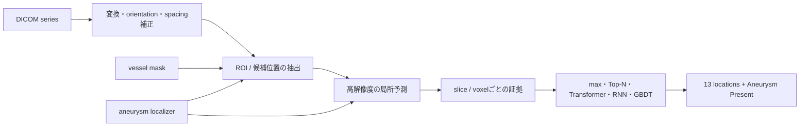
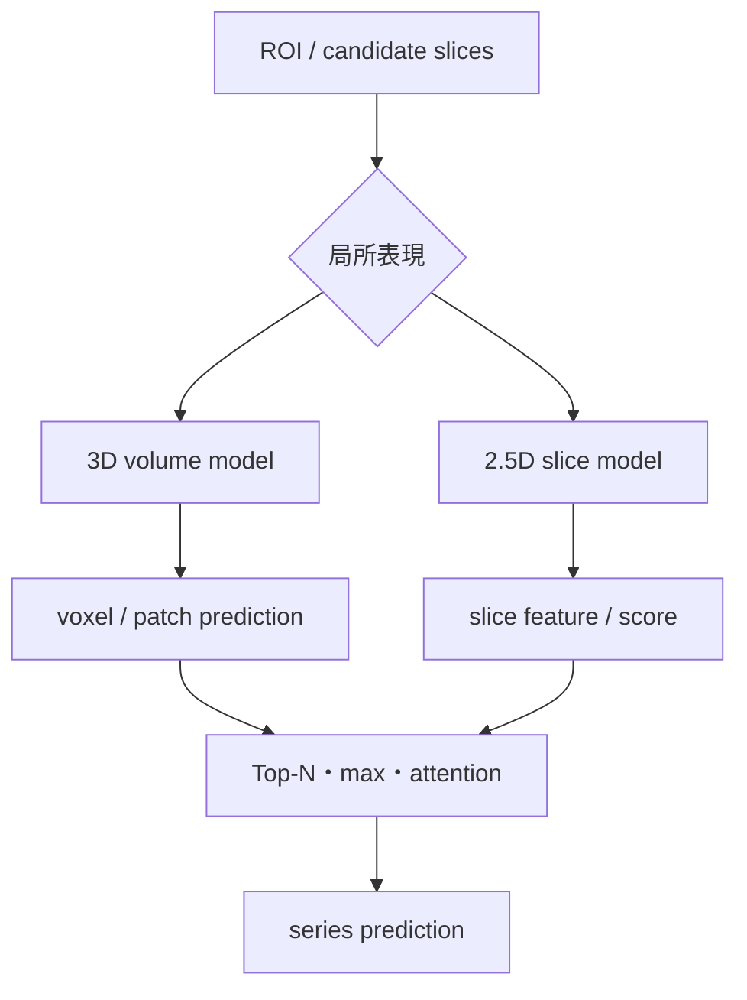

# RSNA Intracranial Aneurysm Detection 上位解法まとめ — 微小病変を「探してから診断する」

## はじめに

頭部の3D医用画像から脳動脈瘤を検出する、[RSNA Intracranial Aneurysm Detection](https://www.kaggle.com/competitions/rsna-intracranial-aneurysm-detection) が2025年10月14日まで開催されていました。

このコンペの上位解法を一通り読むと、使われたモデルは3D nnU-Net、3D ResNet、2.5D CNN、Transformer、RNN、GBDTとかなり多様です。それでも、問題の解き方には明確な共通点がありました。

> **巨大な3D volumeからいきなり診断するのではなく、まず動脈瘤があり得る場所へ探索範囲を絞り、局所的な証拠を集めてからseries全体の予測へまとめる。**

この記事では、最終1〜11位のうち一次Solutionを取得できた10チームを、順位別ではなく実際のpipeline順に横断して整理します。各手法の詳細や厳密な再現条件は、リンク先の元Solutionもあわせて確認してください。

> 取得時のKaggle CLI leaderboardには、終了時の順位と整合しないscore 1.00000の`perfect_submission.parquet`が先頭行として含まれていました。本記事ではこの異常行を除外した検証済みの最終順位を使用しています。10位の一次SolutionはKaggle CLIで取得できたDiscussion内では確認できなかったため、解法を推測して補っていません。

## コンペ概要

### タスク

各患者の頭部DICOM seriesから、次の14ラベルを予測するmulti-label classificationです。

- 13の解剖学的位置それぞれに動脈瘤が存在するか
- series内のどこかに動脈瘤が存在するかを表す`Aneurysm Present`

評価指標はweighted multilabel ROC-AUCです。`Aneurysm Present`にはweight 13、各locationにはweight 1が与えられるため、最終scoreは実質的に次の2要素を半分ずつ評価します。

1. 患者に動脈瘤があるか
2. 13部位のどこにあるか

単に病変を見つけるだけでなく、左右を含む血管上の位置まで正しく予測する必要がありました。

### 提供データ

| データ | 内容 | 解法上の役割 |
|---|---|---|
| DICOM series | CTA、MRA、MRI T1-post、MRI T2など複数modality | classificationの入力。orientation、spacing、slice数が不均一 |
| `train.csv` | series単位の14ラベル | 最終predictionの教師 |
| `train_localizers.csv` | 動脈瘤のslice ID、xy座標、location | ROI、positive slice、heatmap、keypoint教師 |
| `segmentations/` | 一部seriesの13-class vessel mask | 血管ROI、解剖学的位置、samplingの教師 |

testは約2,500 seriesで、Evaluation APIから1 seriesずつ渡されます。GPU notebookは12時間以内、internetなしで完走する必要がありました。

### このコンペが難しい理由

- 動脈瘤は3D volume全体に対して非常に小さい
- slice単位では正例が極端に少ない
- modalityや施設によってintensityと見え方が異なる
- DICOM tagの欠損、破損、orientation、voxel spacingの異常がある
- location予測では左右と血管解剖を保持する必要がある
- 3D model、fold、TTAを積むと12時間を超えやすい

## 上位解法の全体像

上位解法の多くは、次のような2〜3段階のpipelineとして理解できます。

チーム間で最も違ったのは、`C: どこを見るか`、`D: 局所をどう読むか`、`F: 局所予測をどうまとめるか`の3点です。

## 1. 最初に「どこを見るか」を決める

### full volumeの直接分類が難しい理由

動脈瘤は強く局在するため、volume全体の大部分は学習にとってnoiseです。

[3位 BTYND](https://www.kaggle.com/competitions/rsna-intracranial-aneurysm-detection/discussion/611856)はwhole volumeで3D classifierを学習したものの、lossが安定せずscoreも0.7を超えませんでした。32枚や62枚へ圧縮した入力も、小さな動脈瘤やz-axisの長いCTAで必要な情報を失い、性能に上限があったと説明しています。

そこで上位チームは、次のいずれかで探索範囲を狭めました。

| ROIの作り方 | 代表例 | 特徴 |
|---|---|---|
| vessel segmentation | [1位](https://www.kaggle.com/competitions/rsna-intracranial-aneurysm-detection/discussion/611846)、[2位](https://www.kaggle.com/competitions/rsna-intracranial-aneurysm-detection/discussion/611867) | 血管解剖を直接使えるが、3D segmentationのcostが高い |
| 2D画像から3D boxを復元 | [2位](https://www.kaggle.com/competitions/rsna-intracranial-aneurysm-detection/discussion/611867)、[3位](https://www.kaggle.com/competitions/rsna-intracranial-aneurysm-detection/discussion/611856) | tri-axial sliceやsagittal/coronal viewだけで高速にROIを推定 |
| crop座標を直接回帰 | [4位](https://www.kaggle.com/competitions/rsna-intracranial-aneurysm-detection/discussion/611893) | mask生成を省き、ROI境界だけを学習 |
| brain / skull crop | [5位](https://www.kaggle.com/competitions/rsna-intracranial-aneurysm-detection/discussion/611849)、[6位](https://www.kaggle.com/competitions/rsna-intracranial-aneurysm-detection/discussion/611925) | 解剖学的な大枠を安価に除外 |
| 固定anatomical crop | [7位](https://www.kaggle.com/competitions/rsna-intracranial-aneurysm-detection/discussion/612039) | 中央上部の固定mm ROI。単純だが十分強い |
| localizer周辺を直接sample | [8位](https://www.kaggle.com/competitions/rsna-intracranial-aneurysm-detection/discussion/613534) | volumeを再構成せず、病変spotと難しい負例を学習 |

### ROI cropはarchitecture変更より大きく効いた

[4位](https://www.kaggle.com/competitions/rsna-intracranial-aneurysm-detection/discussion/611893)は、ROI cropによってscoreが約0.7から0.8へ上がったとQ&Aで説明しています。その後のclassificationはかなり単純で、ROI上のCoaT baselineがCV 0.805、rotation追加で0.83、2.5D化で0.86となりました。

[5位](https://www.kaggle.com/competitions/rsna-intracranial-aneurysm-detection/discussion/611849)も、lungなどの背景を除くbrain cropだけで約+0.03〜0.05を報告しています。[7位](https://www.kaggle.com/competitions/rsna-intracranial-aneurysm-detection/discussion/612039)は当初full imageを処理していましたが、時間制約から固定ROIへ変更すると速度だけでなく精度も改善しました。

ROIには次の3つの効果があります。

1. background noiseを減らす
2. 同じ計算量で病変を高解像度に見せる
3. positiveとnegativeのsamplingを制御しやすくする

### 良いlocatorは「精密」より「見逃さない」

ROI modelの目的は、きれいなmaskを作ることではありません。

[1位](https://www.kaggle.com/competitions/rsna-intracranial-aneurysm-detection/discussion/611846)のfine vessel segmentationはvalidation Diceが約0.70でしたが、著者はDiceそのものよりsmall vesselとperipheral branchのrecallを重視しています。maskは最終出力ではなく、classifierが見る場所を決めるguideだからです。

[11位](https://www.kaggle.com/competitions/rsna-intracranial-aneurysm-detection/discussion/612186)の2.5D CoW segmentationもDice 0.56でした。それでも抽出featureはRNNへ解剖学的なposition情報を渡すために役立ちました。

一方でROIを小さくしすぎると病変を落とします。1位ではcleaned train内の10 aneurysmがvessel ROI外にありましたが、上方marginを広げるmemory・computeとのtrade-offからrare caseとして許容しています。

## 2. DICOMを正しく揃える

医用画像では、modelへ入る前の座標系が崩れると、後段のarchitectureをどれだけ工夫しても正しい位置を学べません。

### modalityと座標系が混在する

CTA、MRA、T1-post、T2では血管と動脈瘤の見え方が異なります。さらにseriesごとにorientation、slice spacing、slice順、pixel spacingが異なります。

[1位](https://www.kaggle.com/competitions/rsna-intracranial-aneurysm-detection/discussion/611846)はDICOMを`dcm2niix`でNIfTIへ変換し、失敗時には`gdcmconv --raw`を挟むfallbackを用意しました。orientation異常、corrupted DICOM、不自然なspacingを持つ約60 seriesは学習対象から除外しています。

[2位](https://www.kaggle.com/competitions/rsna-intracranial-aneurysm-detection/discussion/611867)は3 axisから各3 sliceを取り、2D segmentation結果を平均して3D ROIを作りました。理論上は各axis 1 sliceでも足りる場合が多いものの、中心から外れた血管やoutlier予測への冗長性として3枚を使っています。

### metadataが無ければ画像から推定する

[3位](https://www.kaggle.com/competitions/rsna-intracranial-aneurysm-detection/discussion/611856)はtestのDICOM tag欠損に対し、EfficientNetV2-Sでx/y/z voxel spacingを画像から回帰しました。validation MAEはx 0.015 mm、y 0.020 mm、z 0.071 mmで、このfallbackによってPrivate LBが0.84から0.85へ改善しています。

これはmodelを1本追加したというより、**testで壊れる前処理を学習可能なfallbackで補った**例として重要です。

### resamplingは標準化すれば良いとは限らない

3D医用画像ではisotropic resamplingが自然に見えますが、このコンペでは逆効果の例もありました。

- [7位](https://www.kaggle.com/competitions/rsna-intracranial-aneurysm-detection/discussion/612039)の1 mm isotropic resamplingは大幅に悪化
- [9位](https://www.kaggle.com/competitions/rsna-intracranial-aneurysm-detection/discussion/611908)のz-spacing standardizationも一貫して悪化
- 9位はresamplingなしの2.5D化でCVが+0.02超改善

slice厚の情報や元画像のinterpolation特性まで変えてしまうため、「物理空間を揃える」という一般論だけで決めず、modality別に検証する必要があります。

## 3. ROI内をどう読むか — 3Dと2.5D

ROIを作った後の解法は、大きく3D系と2.5D系に分かれました。

### 3D系 — 解剖と位置を直接model化する

[1位](https://www.kaggle.com/competitions/rsna-intracranial-aneurysm-detection/discussion/611846)はsegmentation-pretrained nnU-Net backboneをclassifierへ転用し、locationごとのvessel maskでfeatureをpoolingしました。reduced inputでのablationは次のとおりです。

| 構成 | Score |
|---|---:|
| Final model | 0.902 |
| Location-Aware Transformerなし | 0.896 |
| loss weightをすべて1.0 | 0.884 |
| auxiliary aneurysm segmentationなし | 0.876 |
| vessel segmentation pretrainingなし | 0.794 |

最も大きいのはTransformerの有無ではなく、**血管segmentationでbackboneを事前学習したか**でした。最終目的はclassificationでも、局所構造を学ぶ教師がrepresentationを大きく変えています。

[3位](https://www.kaggle.com/competitions/rsna-intracranial-aneurysm-detection/discussion/611856)は3D ResNet-18の最終global featureではなく、高解像度feature mapの各位置へ14-class headを置きました。inputを128³から196³、feature mapを8³から25³へ上げると、single-fold LBは0.77から0.81へ改善しています。微小病変をglobal pooling前に消さない設計です。

[7位](https://www.kaggle.com/competitions/rsna-intracranial-aneurysm-detection/discussion/612039)はさらに単純で、13位置のaneurysm centerをEDT sphereとして表し、そのmaxを`Aneurysm Present`とする14-channel blob regressionをnnU-Netで解きました。single model、TTAなしでPublic/Privateとも約0.83でした。

### 2.5D系 — 高解像度とdepth contextを両立する

2.5Dは、対象sliceと前後sliceをRGB channelのように2D backboneへ入力します。full 3Dより軽く、ImageNetやDINOv3のpretrained backboneを使いながら、局所的なdepth変化を残せます。

| チーム | 局所model | depthの持たせ方 |
|---|---|---|
| [4位](https://www.kaggle.com/competitions/rsna-intracranial-aneurysm-detection/discussion/611893) | CoaT / MaxViT | `(-2, 0, +2)` slice |
| [5位](https://www.kaggle.com/competitions/rsna-intracranial-aneurysm-detection/discussion/611849) | ViT / EVA / MIT-B4 | localizer周辺の2.5D slice |
| [6位](https://www.kaggle.com/competitions/rsna-intracranial-aneurysm-detection/discussion/611925) | CoAtNet / MaxViT | spacingに応じて隣接frame距離を変更 |
| [8位](https://www.kaggle.com/competitions/rsna-intracranial-aneurysm-detection/discussion/613534) | ConvNeXt DINOv3 | step 1 / step 2の2種類 |
| [9位](https://www.kaggle.com/competitions/rsna-intracranial-aneurysm-detection/discussion/611908) | YOLO / EfficientNetV2-S | 前後3 sliceで局所変化を検出 |
| [11位](https://www.kaggle.com/competitions/rsna-intracranial-aneurysm-detection/discussion/612186) | CoAtNet / EfficientNet | CoW featureとaneurysm featureを別抽出 |

[4位](https://www.kaggle.com/competitions/rsna-intracranial-aneurysm-detection/discussion/611893)では2.5D追加でCV 0.83から0.86へ改善しました。ただし弱いpipelineの段階では`[-1,0,1]`や`[-2,0,2]`を試しても効かなかったとQ&Aで説明しています。2.5D自体が魔法なのではなく、ROIによりtargetを正しく学べる状態になってからdepth情報が価値を持ちました。

## 4. 極端な不均衡をsamplingで解く

4位のdatasetでは約545,000 slice中、positiveは約2,200 sliceでした。14ラベルの要素で数えると、modelが1を出すべき値は約1,700個に1個です。

この状況で全negativeを均等に学習しても、簡単なbackgroundばかりを覚えてしまいます。上位解法ではloss weightより、**何をnegativeとして見せるか**が重視されました。

### vessel上のnegativeを選ぶ

[6位](https://www.kaggle.com/competitions/rsna-intracranial-aneurysm-detection/discussion/611925)はvessel segmentationを最終予測には使わず、動脈瘤と紛らわしい血管sliceをnegativeとしてsampleするために使いました。

さらに次の変更が、それぞれCV約+0.01だったと報告しています。

- skull内をさらにanatomical crop
- 強いShiftScaleRotateとcolor augmentation
- CutMix / MixUp
- labelも入れ替えるhorizontal flip
- 隣接frame入力
- spacing-awareなframe sampling
- 手修正localizerによるpositive sampling改善

### OOF false positiveを次のnegativeにする

[8位](https://www.kaggle.com/competitions/rsna-intracranial-aneurysm-detection/discussion/613534)は初期classifierのOOF predictionからfalse positive位置を集め、次の学習でより頻繁にsampleしました。

[11位](https://www.kaggle.com/competitions/rsna-intracranial-aneurysm-detection/discussion/612186)も3 roundのnegative samplingを実施しています。1 round目はCoW modelでvessel sliceを選び、次の2 roundはaneurysm model自身のOOF false positiveをhard negativeにしました。

これは「negativeを増やす」のではなく、**現在のmodelが何を病変と誤認しているかを次の教師にする**方法です。

### label自体を修正する

[2位](https://www.kaggle.com/competitions/rsna-intracranial-aneurysm-detection/discussion/611867)はleft/right、ICA位置、T1-post/T2のhard caseを手作業で修正しました。同じ4x TTAで、annotation改善前のPrivate 0.82508から改善後0.85718へ上がっています。

[5位](https://www.kaggle.com/competitions/rsna-intracranial-aneurysm-detection/discussion/611849)は2モデルが`Aneurysm Present > 0.9`と予測したnegative 33 seriesをpositiveへ変更し、localization labelも作りました。brain cropは約+0.03〜0.05、左右label swap付きflipは約+0.01でした。

## 5. sliceの証拠をseries predictionへまとめる

局所modelが出すのはsliceやvoxelごとのpredictionです。提出に必要なのはseries単位の14確率なので、最後にaggregationが必要です。

### max / Top-N — 最も強い局所証拠を使う

- [4位](https://www.kaggle.com/competitions/rsna-intracranial-aneurysm-detection/discussion/611893)、[5位](https://www.kaggle.com/competitions/rsna-intracranial-aneurysm-detection/discussion/611849): slice方向のmax
- [3位](https://www.kaggle.com/competitions/rsna-intracranial-aneurysm-detection/discussion/611856): voxel predictionをsortしてTop-N mean
- [7位](https://www.kaggle.com/competitions/rsna-intracranial-aneurysm-detection/discussion/612039): patch内・patch間ともchannel-wise max

動脈瘤は局在するため、平均より最大付近のscoreが自然です。ただし1個のfalse positiveにも弱いため、hard-negative samplingとセットになっています。

### sequence model — depth方向の位置関係を学ぶ

[6位](https://www.kaggle.com/competitions/rsna-intracranial-aneurysm-detection/discussion/611925)はframe predictionのmaxだけでCV 0.87、sequence modelで0.88、3-model ensembleで0.895へ伸ばしました。

[8位](https://www.kaggle.com/competitions/rsna-intracranial-aneurysm-detection/discussion/613534)はConvNeXt DINOv3のfeature sequenceをTransformerへ入力しました。[11位](https://www.kaggle.com/competitions/rsna-intracranial-aneurysm-detection/discussion/612186)はCoWとaneurysmのfeatureをLSTM、GRU、BiLSTM、BERTで統合しています。

sequence modelの価値は、単に多くのsliceを見ることではありません。病変候補がseries内のどの位置にあり、前後でどう変化するかを学べる点にあります。

### GBDT stacking — 他locationの予測も特徴にする

[9位](https://www.kaggle.com/competitions/rsna-intracranial-aneurysm-detection/discussion/611908)は2種類のYOLOと3D CenterNetの全location予測を、LightGBM、XGBoost、CatBoostへ入力しました。

あるlocationを予測するときも、他locationのscoreを含めた方がCVが改善したためです。parallel構成のmeta-classifierは5-fold CV 0.858で、単純なseries構成の0.841を上回りました。

## 6. 12時間以内に完走させる

このコンペでは、精度の高いpipelineを作るだけでなく、Evaluation API上で安定して最後まで動かす必要がありました。

### runtimeが最終モデルを変えた例

- [7位](https://www.kaggle.com/competitions/rsna-intracranial-aneurysm-detection/discussion/612039): 3000 epochまで学習したが、成功した提出は1500 epoch checkpointのみ。後期checkpoint、TTA、Gaussian weightingはtimeout
- [8位](https://www.kaggle.com/competitions/rsna-intracranial-aneurysm-detection/discussion/613534): 同じcodeでも8時間未満から12時間超まで揺れ、提出のほぼ半数がtimeout
- [9位](https://www.kaggle.com/competitions/rsna-intracranial-aneurysm-detection/discussion/611908): 5-fold提出を完走できず、最終は2-fold average
- [11位](https://www.kaggle.com/competitions/rsna-intracranial-aneurysm-detection/discussion/612186): 11 CNN + 45 RNNを2 T4へ分割して並列実行

ROI crop、frame間引き、dual GPU、fold削減は単なる高速化ではなく、最終scoreを決めるmodel designでした。

[6位](https://www.kaggle.com/competitions/rsna-intracranial-aneurysm-detection/discussion/611925)は、3モデルではなく2モデルなら7時間で実行でき、別の3D branchをblendする余裕があったはずだと振り返っています。単体modelを少し強くすることと、異質なbranchを追加できる余白を作ることのtrade-offです。

## 7. Validationが高くても安心できない

上位解法ではCVとLeaderboardのgapが非常に大きくなりました。

[7位](https://www.kaggle.com/competitions/rsna-intracranial-aneurysm-detection/discussion/612039)はinternal validationが0.9まで上がった一方、Public/Privateはともに約0.83でした。

[11位](https://www.kaggle.com/competitions/rsna-intracranial-aneurysm-detection/discussion/612186)では、CV 0.9035のself-distillation案がPrivate 0.81321、CV 0.8909の別案がPrivate 0.82201でした。高CVの方がPrivateで約0.009低い結果です。

著者は可能性として、test siteのdomain shiftでbrain segmentatorが壊れたことや、orientation/scalingに使ったDICOM tagの問題を挙げています。

多段pipelineでは、最終classifierのCVだけでは次の故障を捉えられません。

- ROI stageが未知施設でずれる
- DICOM変換やorientation判定が失敗する
- modality比率が変わる
- hard filterが病変を落とす
- runtime fallbackへ入るseriesが増える

CVは最終AUCだけでなく、stage別のROI recall、変換失敗率、modality別score、runtime分布まで診断する必要があります。

## 上位解法から見えた、特に重要な発見

### 1. ROIは前処理ではなく、学習問題そのものを変える

full volume classificationを局所classificationへ変えることで、病変の見かけの大きさ、positive比率、利用できる解像度、lossの安定性が同時に変わりました。上位で使われたbackboneが多様でも、ROIがほぼ共通だった理由です。

### 2. segmentationは最終maskが目的でなくてもよい

maskはROI、sampling、attention、position feature、pretrainingとして使えます。Diceが高くなくてもdownstream classificationを改善できるため、補助taskは単独metricではなく主taskへの寄与で評価すべきです。

### 3. 3Dか2.5Dかより、微小signalを消さないことが重要

3D上位はROIと高解像度feature mapを使い、2.5D上位は高いin-plane解像度と隣接sliceを使いました。どちらも「全体を粗く要約しない」という点で一致しています。

### 4. DICOM fallbackも競技モデルの一部

missing spacingを画像から回帰してPrivate +0.01を得た3位の例は、前処理エラーへの対応がarchitecture改善と同等以上の価値を持つことを示しています。

## うまくいかなかったアプローチ

上位Solutionで繰り返し見られた失敗も、かなり勉強になります。

- **whole volumeの粗い直接分類**: 小病変を失い、lossも不安定
- **segmentation maskによるhard filter**: 9位ではinvalid location除去によりrecallが大幅低下
- **1 mm isotropicへの一律resampling**: 7位で大幅悪化
- **class weightやweighted samplingだけの不均衡対策**: 4位・7位では有効でなかった
- **複雑なMIL/LSTM/decoderをROIの代わりにする**: 3位で安定改善なし
- **end-to-end CNN + RNN**: 6位では性能が低く、早くoverfit
- **Publicで良いdetection構成を選ぶ**: 7位のnnDetectionはPublicでは強いがPrivateとinternal validationで劣化
- **検証した最大構成を最後に詰め込む**: 7〜9位ではtimeoutによりfold、TTA、checkpointを妥協

複雑なmodelが失敗したというより、局所化、data pipeline、sampling、runtimeが未解決のままarchitectureだけを強くしても効果が出にくかったと読むのが自然です。

## まとめ

RSNA Intracranial Aneurysm Detectionの上位解法は、model familyだけを見ると非常に多様でした。しかし問題の分解方法は驚くほど共通しています。

1. DICOMを正しい座標系と強度へ揃える
2. 病変が存在し得る領域へ探索範囲を絞る
3. localizerやmaskを補助教師として局所featureを学ぶ
4. hard negativeを選び、微小病変を消さない解像度で予測する
5. slice / voxelの証拠をseries predictionへ集約する
6. 全stageを12時間以内に安定して完走させる

このコンペから他タスクへ持ち帰りたいのは、特定のnnU-NetやDINOv3ではありません。

> **signalが入力全体に対して小さいときは、最初から全体分類として解かず、「候補抽出 → 局所予測 → 全体集約」へ分解する。補助label、sampling、前処理、runtimeまで含めて一つのmodelとして設計する。**

これは病変検出だけでなく、製造欠陥、衛星画像の微小物体、長時間動画のイベント検出、長文書内の異常箇所探索などにも通じる考え方だと思います。

## 参照した上位Solution

1. [1st Place Solution — tomoon33](https://www.kaggle.com/competitions/rsna-intracranial-aneurysm-detection/discussion/611846)
2. [2nd Place Solution — BraveCoWCoW](https://www.kaggle.com/competitions/rsna-intracranial-aneurysm-detection/discussion/611867)
3. [3rd Place Solution — BTYND](https://www.kaggle.com/competitions/rsna-intracranial-aneurysm-detection/discussion/611856)
4. [4th Place Solution — Harshit Sheoran](https://www.kaggle.com/competitions/rsna-intracranial-aneurysm-detection/discussion/611893)
5. [5th Place Solution — more CV challenge pls](https://www.kaggle.com/competitions/rsna-intracranial-aneurysm-detection/discussion/611849)
6. [6th Place Solution — Ian, Theo & Bartley](https://www.kaggle.com/competitions/rsna-intracranial-aneurysm-detection/discussion/611925)
7. [7th Place Solution — MIC-DKFZ](https://www.kaggle.com/competitions/rsna-intracranial-aneurysm-detection/discussion/612039)
8. [8th Place Solution — Konni](https://www.kaggle.com/competitions/rsna-intracranial-aneurysm-detection/discussion/613534)
9. [9th Place Solution — Vibes and Genius Trade-Off](https://www.kaggle.com/competitions/rsna-intracranial-aneurysm-detection/discussion/611908)
10. [11th Place Solution — ←→AB](https://www.kaggle.com/competitions/rsna-intracranial-aneurysm-detection/discussion/612186)
