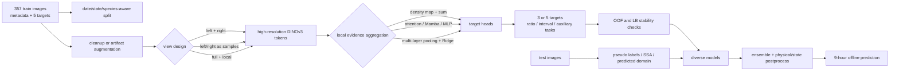
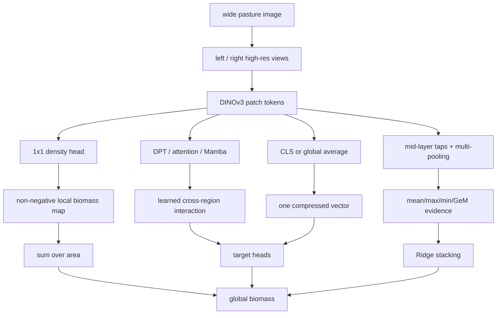

# CSIRO - Image2Biomass Prediction 上位解法まとめ — 局所密度を残し、分布差を別問題として解く

## はじめに

[CSIRO - Image2Biomass Prediction](https://www.kaggle.com/competitions/csiro-biomass) は、牧草地を真上から撮影した画像から、緑草・枯草・クローバーと、それらを合成した5種類の乾燥biomassを推定する画像回帰コンペである。最終提出期限は2026年1月28日だった。

上位にはDINOv3のfine-tuning、密度map、Mamba、MLP、Mixture-of-Experts、さらにfrozen 7B feature＋Ridgeまで並んだ。しかし、モデル名の多様さに反して、強い解法が解いていた問題は共通している。357枚という小さなtrain画像から、撮影条件とfarm/seasonの偏りを越え、画像内の細かな草種と量の証拠を失わずに集約することだ。

> **勝負を分けたのは「大きなmodel」そのものではない。局所biomassの証拠を高解像度のまま残し、validationの不確実性とtest分布差を、表現学習とは別の段階で制御することだった。**

本稿は公式最終リーダーボードの1〜17位を対象に、Kaggle CLIが公開Discussion一覧として取得できた範囲から、first-party Solutionを確認できた10チーム・11投稿を横断している。6位、11位、12位、14位、15位、16位、17位については、検索したDiscussion内で現在の最終順位・team・投稿者を十分に結び付けられるfirst-party Solutionを確認できなかった。これはSolutionが存在しないという意味ではない。

以下では順位別のカードを並べない。`validation → 入力の作り方 → 局所表現 → 集約 → target設計 → domain shift → ensemble/runtime` という、実際の因果pipelineに沿って比較する。

## コンペ概要

### タスク

入力は2000×1000程度の横長の牧草画像で、画像ごとに `Dry_Green_g`、`Dry_Dead_g`、`Dry_Clover_g`、`GDM_g`、`Dry_Total_g` の5値をgram単位で予測する。`GDM_g = Dry_Green_g + Dry_Clover_g`、`Dry_Total_g = GDM_g + Dry_Dead_g` という物理的関係がある。

評価は全 `(image, target)` 行をまとめたglobally weighted R²で、重みはGreen/Dead/Cloverが各0.1、GDMが0.2、Totalが0.5である。target別R²の平均ではないため、Totalの大誤差を減らす価値が高い一方、5targetの整合性を崩すと同じ画像の誤差が複数行へ波及する。

提出はinternetなしのKaggle Notebookで実行し、CPU/GPUとも9時間以内で `submission.csv` を生成する必要があった。testは800枚超で、trainにある `Sampling_Date`、`State`、`Species`、`Pre_GSHH_NDVI`、`Height_Ave_cm` はtest CSVから直接は得られない。

### 提供データ

| データ | 内容 | 解法上の役割 |
|---|---|---|
| `train/` と `train.csv` | 牧草画像、撮影日、州、草種、NDVI、高さ、5target | 主回帰、group split、補助task、artifact/label確認 |
| `test/` と `test.csv` | scoring時に見えるtest画像と5target名 | 画像だけでの本推論、疑似labelやtest-time adaptation |
| `sample_submission.csv` | `(image, target)` ごとのlong形式 | 5targetの順序と提出形式の基準 |
| competition pages | weighted R²、9時間、offline実行条件 | lossの重み、ensemble/TTA/TTTの時間配分 |

### このコンペが難しい理由

- trainは357画像しかなく、foldを変えるだけでlabel・州・季節・草種の分布が大きく変わる。
- 画像は横長かつ高解像度で、clover、枯草、土、影の細かな局所情報を単一vectorへ早く潰すと量の手掛かりが消える。
- trainとtestには強い分布差があり、Public、Private、CVでmodel順位が入れ替わった。
- 日付stamp、赤点、cardboard、疑わしいlabelなど、撮影・収集pipeline由来のsignalとnoiseが混在する。
- 物理式は明確でもlabel noiseがあるため、3targetからhardに再構成する方法と5targetをsoftに整合させる方法の優劣が一定しない。
- DINOv3-Huge/7B、高解像度、fold ensemble、TTA、test-time trainingをすべて9時間へ詰め込むことはできない。

## 上位解法の全体像

上位解法の差は、主に次の5軸へ整理できる。

1. foldを撮影日で完全に分けるか、label/State/Speciesの分布を優先するか。
2. 左右を2-streamとして融合するか、別sampleにしてlabelも半分にするか。
3. CLS/global featureを使うか、patch tokenから密度を積分するか。
4. 5targetを直接予測するか、3target・比率・区間分類・補助taskを使うか。
5. test分布差をensembleだけで受けるか、pseudo-label、TTT、subspace alignment、state推定で適応するか。

## 1. まず「何を信じてmodelを選ぶか」を決める

### 正しいfoldは一つではなかった

同一撮影日に似た画像が集まるため、date groupはleakを避ける自然な選択である。5位Kinosukeはdateをgroupとし、Clover/Deadが0かどうかをstratifyしてCV–LB相関を安定させた。[9位ghatotkachh](https://www.kaggle.com/competitions/csiro-biomass/discussion/671026)もday/month＋Stateをgroup、Clover/Dead presenceをstratifyした。10位owaowataはState–Sampling_Date groupを目視で統合し、5target分布をgreedyに均した。[10位Solution](https://www.kaggle.com/competitions/csiro-biomass/discussion/671053)

一方、date groupが常に正解ではない。2位は、極端なgroup splitでは小標本のlabel・草種・季節分布が崩れるとしてState stratificationを採り、leakの可能性を明記したうえでCV–LB相関とLBを併用した。[2位Solution](https://www.kaggle.com/competitions/csiro-biomass/discussion/670895) 8位PixelScaleもSampling_Date GroupKFoldはfold分散が大きくPublicを改善しなかったため、total bin×speciesのStratifiedKFoldへ切り替えた。[8位Solution](https://www.kaggle.com/competitions/csiro-biomass/discussion/671363)

### 難例だけを良くしてもLBは上がらない

[3位embee](https://www.kaggle.com/competitions/csiro-biomass/discussion/670901)はDINO embedding距離でvalidationをeasy/hardに分けた。当初はhard subsetの改善がtestへ移ると考えたが、実際にはeasy subsetのscoreの方がLBと整合した。testの難例を少し改善するより、予測可能な多数例を確実に取る方がglobally weighted R²を上げた可能性がある。

同チームは最終的にCVを絶対視せず、architectureごとに全foldを使い、19モデルをensembleした。ここでの教訓は「leakなしの最も厳しいfold」を選べ、ではない。**想定するtest生成過程、fold間分散、seed間分散、LBとの順位相関を別々に記録し、model selectionの失敗確率を下げる**ことである。

## 2. 画像を変える前に、targetが保存されるかを問う

### 左右分割は単なるmemory節約ではない

横長画像を左右の正方形へ分ける処理はほぼ共通だった。ただし意味付けは異なる。1位、7位、9位は左右を同じbackboneへ通して後で融合した。[1位Solution](https://www.kaggle.com/competitions/csiro-biomass/discussion/670735) [7位Solution](https://www.kaggle.com/competitions/csiro-biomass/discussion/670654) 4位yanqiangmiffyはleft/rightにfull imageを加えた3-streamで局所と全体を併用した。[4位Solution](https://www.kaggle.com/competitions/csiro-biomass/discussion/670668)

5位Kinosukeはさらに踏み込み、左右を別sampleにしてlabelも半分にした。この方法はDINOv3、EVA02-CLIP、SigLIPで2-stream concatenationを一貫して上回ったという。[5位Solution](https://www.kaggle.com/competitions/csiro-biomass/discussion/671211) これは「左右のbiomassが正確に半分」という主張ではなく、局所量を加算するinductive biasとsample数倍増を同時に与える近似である。

### cleanupとartifact再現は反対ではない

4位はorange timestampをHSV検出してinpaintingした。10位は逆にdate stampとred-dot artifactをaugmentationで再現し、CV/Publicは変わらないがPrivateが+0.01だったと報告した。さらに疑わしいWAの8画像を除くと、CV/Public/Privateが各+0.01改善した。Q&Aで、除去有無modelの `Dry_Total_g` 予測相関は0.897、本文の+0.04は計算ミスで正しくは+0.01と訂正されている。[10位Solution](https://www.kaggle.com/competitions/csiro-biomass/discussion/671053)

5位では同じWAの日付のlabelを手修正するとCVは良くなったがLBは悪化した。[5位Solution](https://www.kaggle.com/competitions/csiro-biomass/discussion/671211) trainのnoiseがtest収集pipelineにも残るなら、cleanな教師へ直すほどdomain mismatchが増える。この3例から、artifactは一律に消すべきnoiseではなく、`targetと無関係なshortcut`、`domain ID`、`testにも続く測定誤差` のどれかを切り分ける必要がある。

### cropは量を変えるのに、なぜ効くのか

2位と5位は `RandomResizedCrop` がlabelを壊しそうだと考えながら、実際にはCV/LBを改善した。両者は撮影距離や画角の揺れを模擬した可能性を挙げる。[2位Solution](https://www.kaggle.com/competitions/csiro-biomass/discussion/670895) [5位Solution](https://www.kaggle.com/competitions/csiro-biomass/discussion/671211) 一方、5位の強すぎるnoiseや `RandomGridShuffle`、1位のmulti-resolution patch入力は不安定またはPrivate悪化だった。

判断規則は単純である。**変換後も総量が保たれるか、保存されないなら現実の撮影変動を近似してbiasを減らす便益が勝つか**を、Publicだけでなくfold/seed方向にも確認する。

## 3. 高解像度より先に、局所証拠を捨てない

### DINOv3が強かった理由をmodel名で終わらせない

5位の同一pipeline比較では、SigLIPがCV/Public/Private 0.75/0.66/0.55、EVA02-CLIPが0.75/0.69/0.584、DINOv3 global featureが0.79/0.73/0.64、DINOv3 dense featureが0.81/0.75/0.66だった。[5位Solution](https://www.kaggle.com/competitions/csiro-biomass/discussion/671211) DINOv3の勝因はpretraining規模だけでなく、green、clover、dead、soilをpatch levelで分けるdense featureを回帰まで保持できた点にある。

8位はbackboneをConvNeXt-tiny→DINOv3-BaseでPublic 0.61→0.67、Base→Largeで0.69→0.72、Large→Huge+で0.72→0.74と伸ばした。一方、640px modelが最良single Private 0.657で、Publicの高い768pxを上回った。[8位Solution](https://www.kaggle.com/competitions/csiro-biomass/discussion/671363) 1位はLargeとHugeが近く、modelを大きくするよりsingle-view 512→1024の方が効率的だった。[1位Solution](https://www.kaggle.com/competitions/csiro-biomass/discussion/670735) 「backbone size」と「局所解像度」は別々にsweepすべきである。

### fine-tuneしない巨大modelも成立した

13位Forrest_xlzはDINOv3 ViT-7Bを完全freezeし、256/512/768、last/block35/block38、mean/max/min/signed-GeMから9 viewを作り、Ridgeをstackした。fullはPublic/Private 0.75696/0.64833に対し、中間layerなしは0.74969/0.62957、average poolingだけでは0.72056/0.60662だった。[13位Solution](https://www.kaggle.com/competitions/csiro-biomass/discussion/671818)

小標本では7Bを更新することより、**どのlayer・scale・poolingから証拠を読むか**の方が大きな改善余地になり得る。deep headが必要とは限らない。

## 4. 局所量をどう全体量へ集約するか

### 最も素朴なdensity headが強い

5位はpatch tokenを2Dへ戻し、1×1 Convで5枚のdensity mapにし、Softplusで非負化して全patchをsumした。headはわずか6,405 parameterである。3×3 Convは学習がNaNになり、単純な1×1だけが安定した。[5位Solution](https://www.kaggle.com/competitions/csiro-biomass/discussion/671211)

2位はConv＋ReLU headと、4中間featureを統合するDPT headの両方をensembleした。DPTはpatchごとの3target heatmapを出す弱教師ありsemantic segmentationとして働く。[2位Solution](https://www.kaggle.com/competitions/csiro-biomass/discussion/670895) ここでpixel mask教師は不要である。画像全体のgramだけでも、局所出力の平均/和をglobal targetへ合わせれば、backboneが持つlocal separationを密度mapとして読み出せる。

### interactionを増やすほど良いわけではない

1位は左右tokenを1層のmulti-head self-attentionで融合し、9位はLocalMamba 2 blockを使った。一方、9位ではMambaを2 blockより増やしても改善せず、4位のsegmentation＋attentionはCV/LBとも0.53、5位の3×3 Convは不安定だった。[9位Solution](https://www.kaggle.com/competitions/csiro-biomass/discussion/671026) [4位Solution](https://www.kaggle.com/competitions/csiro-biomass/discussion/670668)

局所間interactionは、草の重なりや左右contextを扱うためには有用だが、小標本では簡単にmemorization装置になる。まず `patchwise linear projection → nonnegative → sum` と複数poolingを強いbaselineにし、interaction層はその残差を説明できるときだけ足す。

## 5. 5つのtargetを「値」以外でも教える

### hardな物理式か、softな整合性か

2位はGreen/Dead/Cloverの3targetを予測し、GDMとTotalを導出した。5target直接や別の3target構成はPublicが低かった。[2位Solution](https://www.kaggle.com/competitions/csiro-biomass/discussion/670895) 5位は反対に5targetを予測し、物理式をconsistency lossとしてsoftに課した。著者はGreen/Clover間のlabel noiseがあるため、hardな3target化より5target＋regularizationが良かったと説明する。[5位Solution](https://www.kaggle.com/competitions/csiro-biomass/discussion/671211)

9位は難しい `Dry_Dead_g` を、直接値、`Dead/Total` 比、`Total−GDM` の3表現で学習した。Public最高はstandard modelの0.77157だったが、Privateはratio modelの0.65329が最良で、ensembleは0.65179だった。[9位Solution](https://www.kaggle.com/competitions/csiro-biomass/discussion/671026) 物理的に美しい表現とPrivateで強い表現は一致しない。恒等式にlabel noiseが乗るからである。

### 回帰だけでなく「どの量域か」を教える

1位はtargetごとに7区間を作り、5回帰headに5分類headを追加した。Public/Privateとも約+0.03で、512px baseline 0.70/0.60はclassification追加で0.73/0.63になった。[1位Solution](https://www.kaggle.com/competitions/csiro-biomass/discussion/670735) 不均衡な連続値を一点回帰する前に、粗い量域を識別させることで、極端値と零付近を分ける表現が育ったと解釈できる。

### metadataは入力でなく「画像から推定するdomain」にする

8位はspecies classifierの確率をbiomass modelへ注入し、SSA、SigLIP fusionと別pipelineにした。targetをGreen/GDM/TotalからClover/GDM/Totalへ変えるとDINOv3-HugeでPublic 0.73→0.74だったが、Q&Aでは全modelに一般化した結果ではないと限定している。[8位Solution](https://www.kaggle.com/competitions/csiro-biomass/discussion/671363)

4位はNDVI/Height/Species/State auxiliary headとMoEを組み合わせた一方、3位はmetadata headの差が小さく廃止し、5位と9位でもmetadataは効かなかった。[3位Solution](https://www.kaggle.com/competitions/csiro-biomass/discussion/670901) 効くかどうかは「metadataが一般に有用か」ではなく、既存backboneが既に同じsignalを持つか、testで推定誤差込みでもtarget priorを改善するかで決まる。

## 6. train–test分布差を、推論時の独立stageとして扱う

### 生成画像ではlabel不変を仮定しない

2位はQwen Image Editで季節・天候・石を変えた画像と、植生をすべて除いたbackgroundを作った。元labelで学習するとPublicが悪化したため、生成画像を「trainに近い未label外部data」とみなし、元train modelのpseudo-labelを付けた。backgroundは別pipelineで真の0とし、357枚に対して約10枚、synthetic採用確率25%に抑えた。[synthetic data補完投稿](https://www.kaggle.com/competitions/csiro-biomass/discussion/670664) [2位Solution](https://www.kaggle.com/competitions/csiro-biomass/discussion/670895)

Q&Aでは、外部grass datasetはcrop size、grass type、label protocolのdomain gapで失敗し、生成画像も `true_cfg_scale` を上げるほど多様だが元labelが不正確になると説明された。画像回帰のsynthetic dataでは、「見た目のclassは同じ」ではなく「数値targetがどれだけ変わったか」を毎回問う必要がある。

### TTTは教師品質と更新範囲で決まる

1位は4modelでtest pseudo-labelを作り、Large 2モデルを学習、再pseudo-label後にBase 2モデルを学習して>+0.02を得た。著者Q&Aでは自己蒸留と説明している。[1位Solution](https://www.kaggle.com/competitions/csiro-biomass/discussion/670735)

7位はsingle/dual 5-fold平均を教師に、best single foldをfull train＋testで12 epochs学習し、最後4 epochsをSWA、Stage1/TTTを0.2/0.8で混ぜた。non-TTT bestはPrivate 0.65、ほかは約0.64だった。[7位Solution](https://www.kaggle.com/competitions/csiro-biomass/discussion/670654) ただし著者自身、Clover×0.8などpseudo-label前の後処理は賭けに近いと認めている。

3位ではTTTが失敗し、2位は時間がかかりすぎて断念した。8位はbackboneを更新せず、test feature subspaceをtrain PCA subspaceへ合わせるSSA adapterだけを更新し、Private 0.646→0.652を得た。[8位Solution](https://www.kaggle.com/competitions/csiro-biomass/discussion/671363) したがってTTTを一語で評価せず、`teacherの誤差 → 更新parameter → adaptation steps → trainへの戻し方` を分解する。

### state後処理は強いが、因果ではない

2位は画像からStateを98%以上で分類し、WAのDeadを0、state×target scaleを調整した。ensembleはPublic 0.76822→0.77937、Private 0.66153→0.67558と大きく改善した。[2位Solution](https://www.kaggle.com/competitions/csiro-biomass/discussion/670895) 4位と9位もWA/DeadやClover/Deadのscaleを使った。

これはStateがbiomassを生むという因果ではなく、画像がfarm・season・収集条件を識別し、そのdomain固有のtarget priorを使えるということだ。test domainが変われば逆効果になるため、state scalingはmodel本体ではなく、外せる後処理として提出候補を分けるのが安全である。

## 7. ensembleはmodel数でなく、誤差源と9時間で設計する

### 多様性の単位を決める

3位の19モデルはbackbone、metadata有無、CV strategyを跨いだ。4位はseed、augmentation、meta embeddingを変えた5 biomass modelとState専用modelを混ぜた。[4位Solution](https://www.kaggle.com/competitions/csiro-biomass/discussion/670668) 8位はSSA 50%、species-aware 30%、DINO+SigLIP 20%で、domain adaptationの仕組み自体を多様化した。13位は同一frozen 7Bでもscale、layer、pooling、raw/log target space、2/3/5-foldを変えた。[13位Solution](https://www.kaggle.com/competitions/csiro-biomass/discussion/671818)

ただし、ensembleは常にbest singleを超えない。2位では後処理なしensembleのPrivate 0.66153がsingle 0.67156より低かった。13位でも物理後処理ありfullのPrivate 0.64833に対し、後処理なしは0.64986だった。相関したmodelや誤ったhard constraintを平均してもbiasは消えない。

### runtimeをscore改善手段として配分する

2位はFP16とT4×2で推論を約2時間から27分へ短縮した。7位はGPUごとにsingle/dual 5-foldを割り当て、余った時間をTTTへ回した。9位は4-way TTAが9時間を超えるためsubmissionから外した。5位はHuge+ 864pxの5-fold trainingにA100 80GBで20時間を使いながら、提出はT4×2＋FP16へ最適化した。[5位Solution](https://www.kaggle.com/competitions/csiro-biomass/discussion/671211)

最後に解くべき最適化問題は、`model count × resolution × folds × TTA × adaptation steps` の積を9時間へ収めることだ。高相関のTTAを1個増やすより、target表現の異なるmodelや短いadapter更新へ時間を配る方が良い場合がある。

## 上位解法から見えた、特に重要な発見

### 1. foundation modelの価値は、CLSよりpatch tokenに宿った

Dense DINOv3がglobal featureを上回り、1×1 density headやDPT、multi-layer poolingが成功した。biomassのような「局所量の積分」では、強いbackboneを選んだ後の最重要判断は、圧縮前の局所証拠をどこまで残すかである。

### 2. validationはscore推定器ではなく、失敗様式の測定器だった

date group、State stratification、species bin、easy/hard splitは互いに矛盾するが、それぞれ異なるshiftを測る。単一CVを真実にするより、どのmodelがどのsplitで崩れるかをensembleと提出選択へ使う方が堅い。

### 3. 物理関係は「正解を固定する式」より「表現を増やす軸」だった

3target導出、5target consistency、Dead ratio、interval classificationはすべて有効例がある。label noise下では一つを正解にせず、hard/soft、値/比/区間の誤差相関をずらす方がよい。

### 4. domain metadataは画像から推定できるshortcutでもある

State/speciesを画像から高精度に当てられるなら、modelは草の量だけでなくfarmやseasonのpriorも使う。Publicでは強力でも、新domainでshakeを起こす。metadata headとstate scalingは、因果signalではなくdomain adaptation部品として扱うべきだ。

### 5. synthetic dataとTTTの本質は、追加枚数ではなく教師誤差の管理だった

生成画像へ元labelを付けると悪化し、pseudo-labelや0-backgroundの分離で初めて使えた。TTTもteacher ensemble、更新対象、短い学習、trainへの戻しを設計したチームだけが利益を報告した。

## うまくいかなかったアプローチ

- **生成画像へ元の連続labelをそのまま付ける**: 季節や植生を変えればbiomassも変わり、2位ではPublicが悪化した。生成画像は未label dataとして再labelする。
- **厳しいgroup CVを唯一の真実にする**: date groupでfold分布が崩れたチームもあり、8位ではPublicを改善しなかった。leak防止とtest代表性を別指標で測る。
- **大modelを無条件に選ぶ**: 4位のHugeはCV 0.95でもLB 0.72、1位はLarge/Hugeが同等だった。resolution、freeze範囲、seed安定性込みで比較する。
- **複雑な空間headを先に足す**: 4位のsegmentation＋attentionはCV/LB 0.53、5位の3×3 ConvはNaNだった。1×1 density＋sumを先に置く。
- **物理式をhard constraintとして学習へ埋め込む**: 1位では学習中の物理制約が失敗し、5位ではsoft consistencyが成功した。label noiseを確認してhard/softを選ぶ。
- **metadata auxiliaryを万能視する**: 3位、5位、9位で無効、8位でもNDVIはHuge+に効かなかった。backboneが既に持つsignalとの重複を疑う。
- **TTA/TTTを計算量だけ増やして使う**: 3位のTTAは悪化、9位のTTAは9時間超過、2位のTTTは時間で断念した。teacher品質と誤差多様性がない反復は外す。
- **CV改善だけでlabelを手修正する**: 5位ではWA label修正がCVを上げLBを下げた。testにも同じ測定誤差が残る可能性を考える。
- **高相関modelを大量に平均する**: 2位ではensembleがbest singleよりPrivateで低かった。model数でなく、backbone、target表現、domain adaptationの異質性を選ぶ。
- **後処理を不可逆に固定する**: 13位の物理後処理はPublicを上げてもPrivateを僅かに下げた。後処理有無を別提出候補として保持する。

失敗の多くは、手法そのものが悪いのではなく、`label不変性`、`validationが表すshift`、`誤差相関`、`runtime` の前提が実データとずれたために起きた。

## まとめ

このコンペで再構成できる強いpipelineは次の通りである。

1. date、State、Species、zero targetを使い、複数のshiftを測れるfoldを作る。
2. artifactを除く版と再現する版を比較し、左右分割と現実的なscale/cropを設計する。
3. DINOv3のpatch tokenを高解像度で取り出し、backbone sizeとresolutionを別々に選ぶ。
4. まず単純な非負density＋sumまたは複数poolingで局所量を集約する。
5. 3/5target、ratio、interval分類、soft consistencyを比較し、label noiseに合うtarget表現を選ぶ。
6. pseudo-label、SSA、predicted State/Speciesをmodel本体から分離したdomain adaptation stageとして検証する。
7. seed、fold、target表現、adaptationの誤差が異なるmodelだけを、9時間budget内でensembleする。

> **転用すべき原則は、巨大modelをfine-tuneすることではない。「局所量を失わず集約する問題」と「train–test分布差へ適応する問題」を分離し、それぞれの誤差を別のvalidation軸で測ることである。**

この考え方は、crowd counting、収量推定、航空・衛星画像の面積回帰、細胞数推定、音響event量の集約など、入力内の局所証拠を足し合わせてglobalな連続値を出し、かつ収集domainが変わるtaskへ移せる。転用条件は、targetが局所寄与の集約として近似でき、domain IDのshortcutと本来の局所signalを分けて検証できることだ。

## 参照した上位Solution

- Rank 1 — 卷不动了 / [1st Place Solution](https://www.kaggle.com/competitions/csiro-biomass/discussion/670735)
- Rank 2 — dino series / [Synthetic dataset（補完投稿）](https://www.kaggle.com/competitions/csiro-biomass/discussion/670664)
- Rank 2 — dino series / [(2nd) Weakly supervised semantic segmentation + Synthetic data](https://www.kaggle.com/competitions/csiro-biomass/discussion/670895)
- Rank 3 — embee / [3rd Place Solution](https://www.kaggle.com/competitions/csiro-biomass/discussion/670901)
- Rank 4 — yanqiangmiffy / [Rank 5th Solution（現最終順位はteam対応により4位）](https://www.kaggle.com/competitions/csiro-biomass/discussion/670668)
- Rank 5 — Kinosuke / [5th place solution](https://www.kaggle.com/competitions/csiro-biomass/discussion/671211)
- Rank 7 — Genius Seed is all you need / [7th Place Solution - single/dual+TTT](https://www.kaggle.com/competitions/csiro-biomass/discussion/670654)
- Rank 8 — PixelScale 🌿 / [8th Place Solution | PixelScale 🌿](https://www.kaggle.com/competitions/csiro-biomass/discussion/671363)
- Rank 9 — ghatotkachh / [9th Place Solution](https://www.kaggle.com/competitions/csiro-biomass/discussion/671026)
- Rank 10 — owaowata / [10th Place Solution](https://www.kaggle.com/competitions/csiro-biomass/discussion/671053)
- Rank 13 — Forrest_xlz / [13th Place Solution — Frozen DINOv3-7B + Stacked Ridge](https://www.kaggle.com/competitions/csiro-biomass/discussion/671818)
