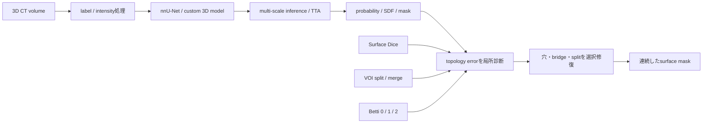
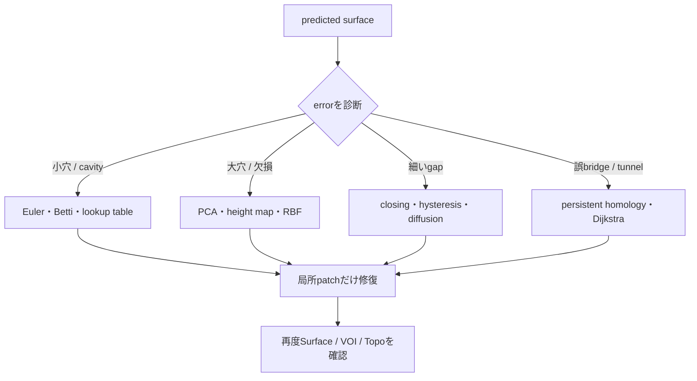

# Vesuvius Challenge - Surface Detection 上位解法まとめ — 3D maskではなく「壊れない一枚の面」を作る

## はじめに

開くことのできない古代パピルスのCT volumeから紙のsurfaceを抽出する[Vesuvius Challenge - Surface Detection](https://www.kaggle.com/competitions/vesuvius-challenge-surface-detection)が、2026年2月27日まで開催されていました。

最終1〜12位の多くはnnU-NetやResEnc UNetを使っています。しかし上位Solutionを読むと、3D segmentation modelだけでは順位を説明できません。同じsheetに開いた小さな穴、隣接sheetをつなぐ数voxelのbridge、細い断裂が、見た目以上にVOIとTopoScoreを壊しました。

> **まず強い3D modelで面の候補を作り、その予測がどのtopology errorを残したかを局所診断し、必要な場所だけを幾何的または学習的に修復する。**

1位はpost-processingだけでPrivate 0.596から0.627へ伸ばし、3位も後段処理で約0.02〜0.03を報告しました。勝負は「voxelを当てる」段階から、「unwrapできる一枚のsurfaceへ直す」段階へ移っていました。

この記事では、一次Solutionを取得できた最終1〜12位の全12チームを、順位別ではなく実際のpipeline順に整理します。

## コンペ概要

### タスク

Herculaneum scrollの3D CT chunkから、パピルスの薄いsurfaceをbinary segmentationする課題です。testはおよそ120 volumeで、各入力と同じshape・data typeの`.tif` maskを`submission.zip`として提出します。

評価は次の3指標の加重平均です。

```text
Score = 0.30 × TopoScore + 0.35 × SurfaceDice@2.0 + 0.35 × VOI_score
```

- Surface Diceは予測surfaceがGTから物理距離2.0以内にあるかを見る
- VOIは同じsheetのsplitと、別sheetのmergeを見る
- TopoScoreはBetti-0/1/2、つまりcomponent・tunnel・cavityの対応を見る

少し位置がずれてもSurface Diceは許容しますが、1本の細いbridgeやholeはVOI/Topoを大きく落とします。通常のoverlap metricとは最適化の優先順位が異なりました。

### 提供データ

| データ | 内容 | 解法上の役割 |
|---|---|---|
| `train/test_images` | 可変shapeの3D CT sub-volume | 3D segmentation入力。scrollやdamage状態が異なる |
| `train_labels` | 0=background、1=surface、2=unlabeled | surface教師。label 2境界が見かけの穴・componentへ影響 |
| `train/test.csv` | volume IDと`scroll_id` | scroll別処理、validation、強度調整 |
| competition metric | Surface Dice、VOI、Betti matching | error type別の診断とpost-processing選択 |
| 追加scroll data | Vesuvius側が公開したunlabeled/追加data | pretraining・pseudo-label候補。ただし上位では決定打でない |

Notebook-onlyでCPU/GPUとも9時間以内、internetなし、公開外部data/modelは利用可能という条件でした。

### このコンペが難しい理由

- targetは厚い3D物体ではなく、複雑に巻かれた数voxel厚のsurface
- 同じsheetの断裂と、隣接sheetの誤接続を同時に避ける必要がある
- Surface Dice、VOI、TopoScoreが異なるerrorを見ており、一方の改善が他方を悪化させる
- label 2のignore regionを消すと、評価対象境界に見かけのloopやcavityが生じる
- volume shapeとscroll densityが異なり、patch contextの最適値が一定でない
- Public subsetが小さく、threshold・fusion・post-processの順位がPrivateで反転した
- 3D multi-fold、large patch、TTA、topology処理を9時間へ収める必要がある

## 上位解法の全体像



上位チームの差は主に次の5点でした。

1. 3D modelへどのpatch sizeと長さでcontextを学ばせたか
2. probability、binary mask、SDFのどの表現を後段へ渡したか
3. topology errorの危険箇所をどう検出したか
4. morphology、projection、homology、learned refinementのどれで直したか
5. PublicとCVが逆行したとき、どの修復強度を残したか

## 1. まず強い3D surface predictorを作る

### nnU-Netがほぼ共通の出発点だった

薄いsurfaceという特殊taskでも、上位の大半はnnU-Net/ResEnc系でした。spacing、patch sampling、augmentation、sliding-window、cascadeを一式持ち、model設計よりdataとmetricへ時間を使えたためです。

[1位 Vesuvius Team](https://www.kaggle.com/competitions/vesuvius-challenge-surface-detection/discussion/679238)は128³ patchを4,000 epochs学習し、192³/256³へのfine-tuneとscratch 192³を組み合わせました。[3位 W & A](https://www.kaggle.com/competitions/vesuvius-challenge-surface-detection/discussion/679236)はFullresからCascadeへ進む2段階を各8,000 epochsまで訓練しています。

[12位 E. Honda.](https://www.kaggle.com/competitions/vesuvius-challenge-surface-detection/discussion/679259)は1,000から4,000 epochs、TTA、multi-resolutionを順に加え、Privateを0.552から0.613まで改善しました。短いbaselineでarchitectureを比較するより、surfaceが収束するまで同じ系統を育てる価値が大きいtaskでした。

### lossはsurfaceの連続性へ寄せる

通常のCE/Diceだけでなく、MedialSurfaceRecall、Skeleton Recall、clDiceなどが使われました。[3位](https://www.kaggle.com/competitions/vesuvius-challenge-surface-detection/discussion/679236)はclDiceをcascadeへ利用し、[7位 DECEM](https://www.kaggle.com/competitions/vesuvius-challenge-surface-detection/discussion/679251)はCE+Dice+Skeleton RecallのResEncM lowresを採用しました。

ただしtopology-aware lossだけで最終maskが完成したわけではありません。model内部のlossは欠損を減らしても、metricが強く罰する少数のloop/mergeを完全には除けず、後段の局所修復が残りました。

### train label処理とtest pipelineを揃える

[7位](https://www.kaggle.com/competitions/vesuvius-challenge-surface-detection/discussion/679251)の最大の発見は、testで使うsurface処理をtrain labelにも適用したことでした。processed-label modelとraw-label modelをensembleし、Frangi sheetness、coherence-enhancing diffusion、anisotropic closingへつなげています。

同Solutionのcontrolled comparisonではSGD 0.590、AdamW 0.594、Muon+AdamW 0.595でした。optimizer差より、教師maskと推論後のsurface定義を揃える方がpipeline全体には重要でした。

## 2. patchを大きくする目的は、sheetの行き先を見ること

### trainより大きいinference contextが効いた

surfaceは局所textureだけでなく、隣接sliceを通じたsheetの連続方向で判別されます。[3位](https://www.kaggle.com/competitions/vesuvius-challenge-surface-detection/discussion/679236)はtrain 128³に対してinference 192³を使いました。modelを変えず、推論時により広い文脈を見せる設計です。

[8位 lingyundev](https://www.kaggle.com/competitions/vesuvius-challenge-surface-detection/discussion/679248)は224³、256³、288³ patchを単純平均し、scaleの違いをensemble diversityへ変えました。[1位](https://www.kaggle.com/competitions/vesuvius-challenge-surface-detection/discussion/679238)も複数patchのmodelを融合しています。

### 大きいほど良いわけではない

contextを広げると欠損は減りますが、離れたsheetを誤接続するriskも増えます。Surface Diceが上がってもTopo/VOIが落ちるため、patch sizeは単体scoreでなくerror type別に選ぶ必要があります。

| 観察 | Surface Dice | VOI / Topo | 読み方 |
|---|---|---|---|
| 小patch | 局所位置は合う | sheetが途中で切れやすい | context不足 |
| 大patch | 連続性が増す | 隣接sheet mergeの可能性 | 過剰なcontext |
| multi-scale | 欠損を相互補完 | 融合threshold次第 | error diversityを使う |
| full-volume | sliding artifactを回避 | memory/runtimeが重い | volumeが収まる場合のみ |

[5位 Dieter](https://www.kaggle.com/competitions/vesuvius-challenge-surface-detection/discussion/679360)は320³ full inferenceでsliding-window artifactを避けました。一方、large contextを使えるcustom modelと、後述するSDF表現・topology修復を一体にしており、patchだけを切り出して真似るべきではありません。

## 3. probabilityをmaskにする段階でerrorの性質が決まる

### thresholdは厚み・穴・mergeのtrade-off

低thresholdはsurface recallを上げますが、sheetを厚くして隣接層をつなぎやすくします。高thresholdはbridgeを減らす一方、弱いsurfaceを切断します。このため上位では単一thresholdだけでなくhysteresisや局所thresholdが使われました。

[12位](https://www.kaggle.com/competitions/vesuvius-challenge-surface-detection/discussion/679259)はhysteresis、opening、anisotropic closingにより単体CVを0.571から0.606、Topoを0.246から0.342へ改善しました。[8位](https://www.kaggle.com/competitions/vesuvius-challenge-surface-detection/discussion/679248)はPerona–Malik系anisotropic diffusion後、z方向だけのhysteresis connectivityを使い、横方向のover-expansionを抑えています。

### probability fusionもoverfitする

[1位](https://www.kaggle.com/competitions/vesuvius-challenge-surface-detection/discussion/679238)は複数modelのprobabilityをweight融合しましたが、Publicを信じたfusionと低いthresholdはPrivate上の最適ではありませんでした。model ensembleの重みとbinarization thresholdを同じPublic subsetへ合わせると、自由度が急増します。

[2位 risk of overfitting](https://www.kaggle.com/competitions/vesuvius-challenge-surface-detection/discussion/679278)は128³/160³ nnUNetを40/60で融合し、globalな修復版は事後Private 0.631でした。それでもlabel-2 riskとPublic/CVからglobal版を選べず、より保守的なlocal版を提出しています。

予測融合、threshold、post-processing strengthは一つのparameter searchとして扱わず、まずmodel OOFを固定し、error type別に段階評価する必要があります。

## 4. topology errorを見つけてから局所修復する

### 全voxelへ同じmorphologyを掛けない

上位のpost-processingは、単純なclosingをvolume全体へ強く掛けるのではなく、危険箇所を選んで処理していました。



### 小穴は局所ruleで安く直せる

[1位](https://www.kaggle.com/competitions/vesuvius-challenge-surface-detection/discussion/679238)は20K未満component除去、height-map interpolation、2³ lookup tableによる1-voxel hole plug、binary closingを順に適用し、Private 0.596から0.627へ改善しました。見た目の大きい穴より、metricへ多数現れる小さなtopology errorの累積が重要でした。

[9位 阿對對對對隊](https://www.kaggle.com/competitions/vesuvius-challenge-surface-detection/discussion/679241)はskeleton+EDT line normalization、gap sandwich、diagonal kernelを5回反復し、Gaussian filterと2×2 bridgeを加えました。CVは0.6096から0.6337です。

この2解法は大規模なhomology libraryだけが必要ではないことを示します。予測が残す典型errorを小さなkernelへ落とせれば、local ruleでも大きく伸びます。

### Euler・Bettiで処理場所を絞る

[2位](https://www.kaggle.com/competitions/vesuvius-challenge-surface-detection/discussion/679278)はEuler numberで問題patchを検出し、高threshold maskを使いながら2D projection上で補間しました。thresholdをvolume全体で下げず、topologyが怪しい局所だけへ別maskを使います。

[4位 Starry](https://www.kaggle.com/competitions/vesuvius-challenge-surface-detection/discussion/679222)はlarge holeをPCA平面へprojectionしてRBF補間し、20³ local blockのBetti-1 errorを修復しました。Betti-2を人工操作する処理はPublic +0.007に対しPrivate +0.001で、metric-specificな自由度ほどdataset依存が強いことも示しています。

[6位 #hui](https://www.kaggle.com/competitions/vesuvius-challenge-surface-detection/discussion/680280)はBetti輪郭、Dijkstraでloopをvolume edgeへ開く処理、RBF、cavity生成まで組み合わせました。scroll densityとignore regionに応じて強度を変え、同じrepairを全volumeへ適用していません。

### error detectorとrepairerは別々に評価する

Euler/Bettiで異常を見つけても、埋める方向を誤れば隣接sheet mergeを作ります。逆にPCA/RBFが正しく補間できても、適用箇所が広すぎれば別のsurfaceをつなぎます。

post-processingは次の2段に分けてablationすべきです。

1. detectorが真のhole/bridgeをどのrecall・precisionで選ぶか
2. 選ばれたpatchでrepair後にSurface Dice、VOI split/merge、Betti-0/1/2がどう動くか

最終scoreだけでは、検出が悪いのか修復が悪いのかを切り分けられません。

## 5. 形状修正をmodelへ学習させる別ルート

### SDFでsurfaceまでの距離を回帰する

[5位](https://www.kaggle.com/competitions/vesuvius-challenge-surface-detection/discussion/679360)は上位で最も異質で、SEResNeXt152 Attention UNetにbinary probabilityではなくsigned distance field（SDF）を回帰させました。

SDFならthresholdを動かすことがsurfaceの膨張・収縮として連続的に表れ、厚みとmergeのtrade-offを扱いやすくなります。さらにpersistent homologyのbirth/death座標へbridge guard付きball fillを13回反復し、不要なsheet接続を避けながらtunnelを埋めました。

### cascadeをlearned post-processingにする

[11位 Aindriú](https://www.kaggle.com/competitions/vesuvius-challenge-surface-detection/discussion/679237)は2つのlowres modelをgeometric meanで融合し、3D Cascade Fullresへ渡しました。cascadeが前段maskを見ながら形状を修正するため、複雑なheuristicなしでも20〜30位圏へ到達しています。

post-process radiusの小さな変更は視覚差がほぼなくても、事後評価では3位相当になり得ました。見た目で選ばずmetricの3成分を保存する必要があります。

### deformation fieldで予測そのものを動かす

[10位 Vibes & Scrolls Trade-off](https://www.kaggle.com/competitions/vesuvius-challenge-surface-detection/discussion/679227)は3 initial modelをResEnc-Lでstackし、refinement、最後にstationary velocity fieldを予測するdiffeomorphic networkでshapeとthicknessを変形しました。

learned geometry correctionはSurface Diceを改善し、競技後にmedian filterを加えるとPrivate 0.614から0.624へ上がりました。複雑なlearned refinementを使っても、残るerror distributionに単純filterが合えば大きく効く例です。

heuristicとlearned refinementは対立ではありません。検出・修復ruleを明示できるerrorは局所処理へ、複数sliceにまたがりrule化しにくい形状はcascade/SDF/deformationへ任せる分担が自然です。

## 6. validationは総合scoreを3つの故障へ分解する

### 同じ総合scoreでも失敗の意味が違う

Surface Diceが高くTopoが低いmodelと、surface位置は少し粗くてもcomponentを保つmodelは、総合scoreが同じでもensemble/post-process後の伸びしろが違います。

validationでは少なくとも次を保存する必要があります。

- volume別Surface Dice
- VOI splitとVOI merge
- Betti-0/1/2別F1
- label-2境界を除いた内部regionと境界近傍
- scroll別、damage密度別、component size別
- post-process前後の差分

[9位](https://www.kaggle.com/competitions/vesuvius-challenge-surface-detection/discussion/679241)はPublic feedbackでline completion版を捨てましたが、競技後CVでは0.6391と最終版0.6337を上回りました。[4位](https://www.kaggle.com/competitions/vesuvius-challenge-surface-detection/discussion/679222)のBetti-2操作もPublicとPrivateで効果量が大きく違いました。

Publicが小さいと、rareなtopology patternの有無だけでpost-processing順位が変わります。thresholdやrepair strengthをPublicへ細かくfitするほど、どのerrorを直したparameterか分からなくなります。

### label 2は評価外でも、学習と検証へ影響する

ignore voxelをbackgroundへ落とすと、評価領域の境界に人工的なholeやcomponentが生じます。[2位](https://www.kaggle.com/competitions/vesuvius-challenge-surface-detection/discussion/679278)が強いglobal修復を最終提出に選べなかった理由の一つもlabel-2 riskでした。

mask処理では、train lossからignoreするだけでなく、metric実装と同じ順でignoreを適用し、内部errorと境界artifactを別集計する必要があります。

## 7. pseudo-labelより、既存教師と推論budgetを使い切る

unlabeled/追加scroll dataは豊富でしたが、上位の決定打ではありません。[3位](https://www.kaggle.com/competitions/vesuvius-challenge-surface-detection/discussion/679236)は全label dataでの長期学習を選び、pseudo-labelを不採用としました。薄いsurfaceの誤接続をpseudo-labelが教師として固定するriskがあったためです。

一方、multi-scale model、長期epoch、TTA、topology processingは3D computeを大量に使います。[6位](https://www.kaggle.com/competitions/vesuvius-challenge-surface-detection/discussion/680280)の6-model系や[12位](https://www.kaggle.com/competitions/vesuvius-challenge-surface-detection/discussion/679259)のlowres/fullres 4-model ensembleでは、9時間内でどのfold・scale・repairを残すかもmodel designでした。

追加dataを増やす前に、既存labelの処理整合、長期収束、patch context、post-processのerror診断へcomputeを配る方が、上位Solutionでは再現性の高い順序でした。

## 上位解法から見えた、特に重要な発見

### 1. metricがpipelineの後半を主役にした

Surface Diceだけならmodelの平均位置精度が中心です。しかしVOIとTopoが65%を占めるため、数voxelのhole/bridgeを見つけて直す処理がmodel交換以上の差を生みました。

### 2. topology-awareとは、全体を強く平滑化することではない

上位ほどEuler、Betti、component、threshold、projectionで危険箇所を選び、局所だけを修復しました。surfaceを守るには、処理の強さより適用場所のprecisionが重要です。

### 3. contextとtopologyはtrade-offである

大patchや長期modelはsheetの断裂を減らしますが、隣接sheet mergeを増やし得ます。patch sizeは総合scoreだけでなくVOI split/mergeとBetti別に選ぶ必要があります。

### 4. representationが修復方法を決める

binary probabilityにはhysteresis/morphology、SDFには連続thresholdとhomology、前段maskにはcascade/deformationが自然に対応しました。後段だけを移植せず、入力表現との組を移すべきです。

### 5. Gold差は「modelが残すerror」と「修復器」の相性にある

1位のlookup rule、5位のpersistent homology、9位のlocal kernel、10位のmedianは、同じ予測へ交換可能な部品ではありません。OOF error atlasを作り、自分のmodelが多く残すfailureへ修復器を合わせる必要があります。

## うまくいかなかったアプローチ

- **大patchを一律に強くする**: contextは増えてもmergeでTopo/VOIが落ち得る。patchごとのerror profileをblend前に比較する
- **probability fusionとthresholdをPublicへ同時fit**: 1位でPrivate最適とずれた。OOF predictionを固定し、融合とbinarizationを分離する
- **globalな強いhole filling**: 2位の事後Privateは強くてもlabel-2 riskから選べなかった。内部regionとignore境界を別評価する
- **Betti数だけを直接操作するmetric hack**: 4位ではPublic +0.007がPrivate +0.001。topology featureの出現分布が変わると効果が移らない
- **Surface Diceだけでmodelを選ぶ**: surface位置が良くてもbridge/splitで最終scoreを落とす。VOI split/mergeとBetti別scoreを同時保存する
- **全volumeへ同じmorphology**: thin sheetを厚くし、別layerをつなぐ。detectorとrepairerを分け、局所適用する
- **pseudo-labelを追加すればcoverageが増えると考える**: topology errorを教師として固定するriskがあり、3位などは不採用。confidenceだけでなく構造整合性を検査する
- **Publicで弱いpost-processを早く捨てる**: 9位のline completionは事後CVで最終版を上回った。rare topology patternを含む複数holdoutを残す
- **複雑なlearned refinementだけで完結させる**: 10位は競技後の単純medianでPrivate +0.010。最終errorに小さなfilterが合うか必ず再確認する

失敗の多くは、修復手法そのものより、どのerrorへ適用するかを分けずに総合scoreだけで選んだことから起きています。

## まとめ

Vesuvius Surface Detectionの上位解法は、次のpipelineとして整理できます。

1. metricをSurface、split/merge、Betti-0/1/2へ分解する
2. train labelとtest時surface処理の定義を揃える
3. 長期3D modelと複数contextでsurface probabilityまたはSDFを作る
4. fusionとbinarizationを分けてOOF上で選ぶ
5. component、Euler、Betti、projectionで危険な局所patchを検出する
6. error typeに応じてmorphology、補間、homology、cascade、deformationで修復する
7. post-process前後の3指標とignore境界を再評価し、9時間内へ収める

> **構造が重要なsegmentationでは、平均voxel精度だけを上げず、「どの構造errorが下流処理を壊すか」をmetricから逆算する。error detectorとrepairerを分離し、自分のmodelが残すerror distributionへ局所修復を合わせる。**

この考え方は血管・神経・道路網・配管・薄膜・細胞境界など、連結性や穴の数が下流利用を決めるtaskへ通じます。移植条件は、単なる見た目ではなく、許容すべき境界ずれと禁止すべきtopology errorを別metricで測れることです。

## 参照した上位Solution

1. [1st Place Solution — Vesuvius Team](https://www.kaggle.com/competitions/vesuvius-challenge-surface-detection/discussion/679238)
2. [A Postprocessing Win — risk of overfitting](https://www.kaggle.com/competitions/vesuvius-challenge-surface-detection/discussion/679278)
3. [3rd Place Solution — W & A](https://www.kaggle.com/competitions/vesuvius-challenge-surface-detection/discussion/679236)
4. [4th Place Solution — Starry](https://www.kaggle.com/competitions/vesuvius-challenge-surface-detection/discussion/679222)
5. [5th Place Solution — Dieter](https://www.kaggle.com/competitions/vesuvius-challenge-surface-detection/discussion/679360)
6. [6th Place Solution — #hui](https://www.kaggle.com/competitions/vesuvius-challenge-surface-detection/discussion/680280)
7. [7th Place Solution — DECEM](https://www.kaggle.com/competitions/vesuvius-challenge-surface-detection/discussion/679251)
8. [8th Place Solution — lingyundev](https://www.kaggle.com/competitions/vesuvius-challenge-surface-detection/discussion/679248)
9. [SUPER-CONSERVATIVE — 阿對對對對隊](https://www.kaggle.com/competitions/vesuvius-challenge-surface-detection/discussion/679241)
10. [10th Place Solution — Vibes & Scrolls Trade-off](https://www.kaggle.com/competitions/vesuvius-challenge-surface-detection/discussion/679227)
11. [11th Place Solution — Aindriú](https://www.kaggle.com/competitions/vesuvius-challenge-surface-detection/discussion/679237)
12. [12th Place Solution — E. Honda.](https://www.kaggle.com/competitions/vesuvius-challenge-surface-detection/discussion/679259)
