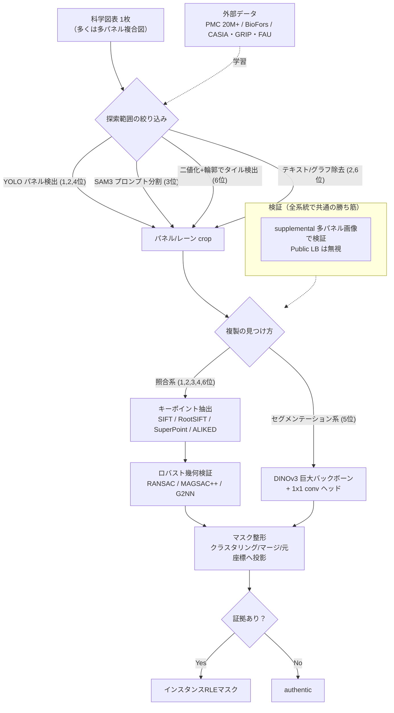
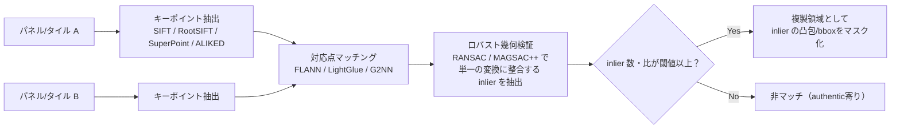
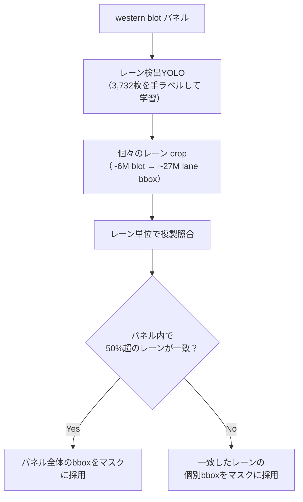

# Recod.ai/LUC Scientific Image Forgery Detection 上位解法まとめ — 「合成画像で学習したセグメンテーション」が効かないコンペで、探索範囲を科学的コンテンツに絞り、幾何的な複製を幾何で見つける

## はじめに

このコンペ [Recod.ai/LUC - Scientific Image Forgery Detection](https://www.kaggle.com/competitions/recodai-luc-scientific-image-forgery-detection) の題材は、生命科学論文の図表に含まれる **copy-move forgery（コピー&ムーブ改ざん）** の検出とセグメンテーションです。ある領域を複製して別の場所に貼り付け、実験結果を捏造する — 撤回論文で最も多い不正の一つを、ピクセル単位で見つけて切り出すことが求められました。ベンチマークは2,000本超の撤回論文から抽出された数百件の確定改ざん事例に基づいており、この分野では最も現実に近いデータセットの一つです。

トレーニングフェーズの最終提出は2026年1月15日、その後に新規収集した非公開テスト画像で評価する forecasting フェーズを経て、コンペは2026年4月22日に終了しました。今回は上位6位までの一次情報（各チーム自身のSolution投稿）を対象に、6ランクすべてで投稿を回収できました。

上位解法のモデルは驚くほど多様です。YOLO+古典SIFT（2位）、学習ゼロのSAM3+SIFT（3位）、DINOv3の巨大バックボーンによるセマンティックセグメンテーション（5位）、SuperPoint+LightGlue（6位）と、まったく異なる系統が並びます。にもかかわらず、上位の戦略には強い共通パターンがありました。

> **このコンペの核心は「探索範囲を実際の科学的コンテンツ（パネル・レーン・タイル）まで絞り込み、幾何的な複製は幾何（キーポイント照合＋ロバストな幾何検証）で見つける」ことにあった。素朴な『合成画像で学習したセグメンテーションNN』は多パネル図表という本番分布に転移せず、意味のないPublic LBではなく supplemental 画像での検証に投資したチームが生き残った。**

本記事は、この問題をどう分解し、どの介入が効き、どこで失敗し、どんな判断則が他コンペへ転移するかを、6つの一次情報から再構成した解説です。特定ランクの物語をなぞるのではなく、勝ち筋のパイプラインを因果の順に並べ直しています。

なお、リーダーボードの異常行（提出ファイル名がチーム名として混入するような行）は今回検出されませんでした。ランク1〜6はいずれも実在チームです。

## コンペ概要

### タスク

入力は1枚の科学図表画像です。多くは複数のパネル（western blot、顕微鏡画像、フローサイトメトリ、グラフなどが並んだ）から成る **compound figure（複合図）** でした。出力は画像ごとに、改ざんが無ければ文字列 `authentic`、有れば複製領域を表す **RLEエンコードされたインスタンスマスク**（1画像に複数可）です。

評価指標は「F1スコアの変種」で、各チームは **oF1（object/instance-level F1）** と呼んでいます。予測した各インスタンスマスクを正解インスタンスに対応付けて採点するため、**「見つける」ことと「別々のインスタンスとして切り分ける」ことの両方**が効きます。この指標の戦略的帰結は大きく、後述するように上位陣はマスクのクラスタリング・マージ・投影といったインスタンス整形を検出と同格の重要工程として扱いました。

### 提供データ

| データ | 内容 | 解法上の役割 |
|---|---|---|
| train_images / train_masks | 学習用画像と改ざん領域マスク（1画像に複数マスク可） | 直接学習には使えるが、種類の多様性に乏しく本番へ転移しにくい |
| supplemental_images / supplemental_masks | コンペ開始後に追加された多パネル図表と正解マスク | **本番（private）テストに最も近い**多パネル分布。上位陣の検証セットの基準 |
| test_images | 採点対象画像 | トレーニングフェーズ約1,100枚（公開論文由来のため**Public LBは無意味**）＋forecastingで新規収集分を追加し規模はほぼ倍 |
| sample_submission.csv | `case_id, annotation`（`authentic` かRLE） | 提出フォーマット |

### このコンペが難しい理由

- **Public LBが公式に「意味がない」と宣言されていた**。トレーニングフェーズのテスト画像は既に公開済みの論文由来で、本番は締切後に新規収集した撤回論文図表。train→private の分布シフトが大きく、Public LBを信じるとshake-upで沈む。
- **有用な信号が入力に対して極端に小さい**。複製された1領域・1レーンは図全体のごく一部で、グラフ軸・テキスト・キャプション・枠線といった無関係な構造が幾何マッチングの偽陽性を量産する。
- **western blot（タンパク質バンド）はテクスチャが乏しく、SIFTが十分なキーポイントを取れない**。顕微鏡画像とは最適な特徴・しきい値がまったく異なる。
- **指標がインスタンス単位**のため、領域を見つけるだけでなく、複数ペアを正しく1インスタンスへ統合し、余計に分割しない後処理が採点に直結する。
- **実行制約が厳しい**。ノートブック、ネット遮断、GPUはT4 16GB、トレーニングフェーズ4時間／forecastingフェーズ9時間。重いモデルや総当たりのキーポイント照合はそのままでは間に合わない。
- **学習に使える本番類似データがほぼ無い**。合成データや外部データ（BioFors、CASIA、PMC等）で埋めるしかなく、その埋め方が成績を分けた。

## 上位解法の全体像

上位6解法は、下図の共通パイプラインの上で「複製の見つけ方」だけが2系統（キーポイント照合系 / セマンティックセグメンテーション系）に分岐する構造でした。

チームが分かれた軸は主に次の4つです。

1. **複製の見つけ方**：幾何照合（キーポイント＋RANSAC）が上位を占め、セグメンテーションは5位のみ。しかも5位は入手可能な最大級のバックボーン（DINOv3 7B）を要した。
2. **探索範囲の絞り方**：学習ベースのパネル検出（YOLO：1,2,4位）／プロンプト式の汎用分割（SAM3：3位）／古典画像処理のタイル検出（6位）。
3. **ドメイン分解の深さ**：1位だけが western blot を「個々のレーン」まで分解して照合した。
4. **検証の置き方**：Public LBを捨て supplemental 画像を基準に選択できたか。

## 1. 出発点の落とし穴：素朴なセグメンテーションは本番分布に転移しない

最初に潰すべき失敗モードは「copy-move改ざんのセグメンテーションだから、（合成または単一パネルの）改ざん画像でセグメンテーションNNを学習すればよい」という素朴な枠組みです。上位陣はここで足を取られませんでした。

3位は明確にこう述べています — 合成した個別画像で学習したNNは、「図（＝多パネル）」ベースの supplemental データにうまく転移しないことを経験的に確認し、**まったく別のアプローチが必要**だと判断した（[3位](https://www.kaggle.com/competitions/recodai-luc-scientific-image-forgery-detection/discussion/674890)）。同チームは ViT-UNet / SegFormer / DINOv3 / Mask2Former を、このコンペのデータに加え CASIA・DefactoCopyMove・figshare_wb 等でも学習したが、いずれも機能しなかったと報告しています。

5位はこの転移失敗を数値で可視化した唯一のチームです。DINOv2モデルはtrain分割では高スコアなのに、supplemental 48枚での検証はわずか **0.092** — 学習データが量はあっても種類が偏っていたため、視覚的に異なる supplemental へ汎化しなかった（[5位](https://www.kaggle.com/competitions/recodai-luc-scientific-image-forgery-detection/discussion/697699)）。

ここでの分岐は2択でした。**(A) 枠組みを変える**（照合ベースへ）か、**(B) 枠組みは保ったまま汎化を強引に買う**（外部データの多様性＋巨大な事前学習）か。1・2・3・4・6位は(A)、5位だけが(B)で生き残りました。

> 判断則：本番の分布が「素朴な学習の枠組み」と食い違うと分かったら、モデルをいじる前に**枠組みそのものか検証対象を変える**。ここでの5位の0.092は「モデルではなくデータ分布が問題」という診断そのものだった。

## 2. 探索範囲を絞る：パネル・レーン・タイルへ分解し、ノイズ源を消す

有用な信号（複製された小領域）は図全体に対して極端に小さく、グラフ・テキスト・枠線が幾何マッチングの偽陽性を量産します。上位陣に共通するのは、照合の前に**「実際の科学的コンテンツ」だけを取り出す**工程でした。手段はチームごとに違います。

- **学習ベースのパネル検出（YOLO）**：1位は Blot／Microscopy を検出（[1位](https://www.kaggle.com/competitions/recodai-luc-scientific-image-forgery-detection/discussion/695702)）、4位は YOLOv5 でパネルを4クラスに分けたうえで Blot と Microscopy だけを残しました（[4位](https://www.kaggle.com/competitions/recodai-luc-scientific-image-forgery-detection/discussion/697621)）。
- **テキストを別建てで消す**：2位は「10 mm」の「mm」部分でキャプション同士が誤マッチする問題を重視し、**専用のテキスト検出YOLO**を用意しました。EasyOCRは丸い細胞を文字「O」と誤認したため、OCR頭ではなく物体検出として学習した点が示唆的です（[2位](https://www.kaggle.com/competitions/recodai-luc-scientific-image-forgery-detection/discussion/694397)）。
- **学習ゼロの汎用分割**：3位はSAM3（Segment Anything 3）に "outlined scientific images"／"microscopic images" 等のドメイン語プロンプトを順に与え、最初にマスクが返ったプロンプトを採用しました（[3位](https://www.kaggle.com/competitions/recodai-luc-scientific-image-forgery-detection/discussion/674890)）。
- **古典画像処理のタイル検出**：6位は学習を一切使わず、グレースケール二値化（しきい値245）＋モルフォロジ＋輪郭抽出でタイルを切り出し、テキスト点はDB50で除去、プロット/図はヒストグラムのスパイク（使用色が少ない）で弾きました（[6位](https://www.kaggle.com/competitions/recodai-luc-scientific-image-forgery-detection/discussion/700586)）。

4位はこの工程をさらに一歩進め、**「照合が不要な図はそもそも走らせない」**という figure-kind 分類を挟みました。検出パネル数と配置から `COMPOUND_MULTI`（2枚以上のBlot/Microscopyパネル）だけをフル照合し、`SIMPLE`／`COMPOUND_SINGLE`／`UNKNOWN` は無条件で `authentic` と予測します。同チームは「パネルファーストが最も重要な決定だった」「照合不要な図を飛ばすことで偽陽性が大きく減った」と述べています（[4位](https://www.kaggle.com/competitions/recodai-luc-scientific-image-forgery-detection/discussion/697621)）。

> 判断則：幾何マッチングの前に、**偽陽性を生む構造（テキスト・グラフ・枠線）を物理的に除去**する。そして「そもそも照合が要らない入力」を早期に authentic へ落とすと、指標（偽陽性に敏感なoF1）が安定する。

## 3. 中核の分岐：複製は幾何で見つける vs 意味で見つける

複製領域の**ローカライズ**で、上位は明確に2系統に割れました。

### 3.1 幾何照合系（1・2・3・4・6位）

パネル/タイルからキーポイントを抽出し、対応点が**同一の幾何変換で説明できるか**をロバスト推定で検証する、という古典的だが強力な流れです。特徴抽出器はチームで違いますが、思想は共通です。

- **1位**：顕微鏡は SIFT＋RANSAC、western blot は自前学習した ALIKED-n16＋LightGlue（Glue Factory）＋MAGSAC。
- **2位**：SIFT を `contrast_threshold=0.001`（既定0.04の約1/40）まで下げて大量のキーポイントを取り、G2NN（Good-to-Next Neighbor, α=0.7）で**しきい値非依存**のマッチング、FLANN KDTreeで高速化、最後にRANSAC＋H行列の妥当性フィルタ（スケール4倍超・せん断を棄却）。
- **4位**：RootSIFT（Hellinger正規化）＋MAGSAC++（inlier≥20）、パネル<300pxはアップスケール、水平反転版でも特徴を取る flip detection。
- **6位**：SuperPoint（2048点）＋LightGlue（早期停止を無効化して取りこぼしを防止）＋RANSAC affine（inlier≥20かつinlier比≥20%）。
- **3位**：SAM3で切ったパネルにCLAHE→テキスト/矢印をぼかし→SIFT→FLANN→Loweの比率テスト→RANSAC（homography）。

### 3.2 セマンティックセグメンテーション系（5位）

5位はこの中で唯一、照合を使わずセグメンテーションで上位に食い込みました。構成は極端に単純で、DINOv3のViTバックボーンの最終パッチトークンを2Dグリッドに戻し、**1×1 Conv2d のヘッド1枚**でロジットマップを出すだけ。インスタンスは分離せず、全改ざん領域の和集合を二値ターゲットとして学習します。単純さと引き換えに、生き残るには2つの高価な代償が要りました（[5位](https://www.kaggle.com/competitions/recodai-luc-scientific-image-forgery-detection/discussion/697699)）。

1. **外部データの多様性**（次節の主題）。競技データのみ 0.092 → CASIA+GRIP+FAU 追加で 0.240（supplemental検証）。
2. **極端に強い事前学習**。DINOv2 Giant→DINOv3 Huge+ で検証 ~0.35、**DINOv3 7B で 0.51**、調整後 **>0.56** まで到達。

上位を幾何照合が占めた事実と、5位が「入手可能な最大級のバックボーン」を必要とした事実は同じことを示しています。

> 判断則：**幾何的な複製は幾何で見つける方が費用対効果が高い**。キーポイント＋ロバスト推定は分布シフトに強く、T4でも回る。セグメンテーションで対抗するなら、事前学習の強さと外部データの多様性を最大限まで買う覚悟が要る。

## 4. ドメイン別の工夫：western blot をどう攻略したか

「幾何で見つける」を選んでも、western blot は最後まで難物でした。テクスチャが乏しくSIFTが十分なキーポイントを取れないという弱点は、1位・2位・3位が口を揃えて指摘しています。ここでの対処の差が、上位内の順位を分けました。

2位はSIFTを捨てずに**極端な低コントラスト閾値＋4倍アップスケール**でキーポイント数を稼ぎ、画像タイプ別にRANSACのinlier閾値を変えました（corn/plantは細い線パターンが誤マッチを生むので厳しく、western blotは特徴が少ないので緩く）。CoreyJamesLevinson（3位）との補足Q&Aでは、western blotが最も苦労した対象で、様々な手法の末にキーポイントベースの空間的手法へ落ち着いたこと、そして自分の手法が**同一パネル内の複製**も検出できることを明かしています（[2位のQ&A](https://www.kaggle.com/competitions/recodai-luc-scientific-image-forgery-detection/discussion/694397)）。

1位はここでコンペ全体を通じて**最大の一手**を打ちました。「blot画像は一意でも、その中の**個々のレーンは一意であるはず**」という仮説に賭け、約1週間かけて3,732枚に手でレーンのbboxを付け、western blot用のレーン検出YOLOを学習。これを約6Mのblotに適用して約27Mのレーンbboxを得ました。パネル単位では見えなかった複製が、レーン単位の照合で見え始めます。

効果は Public LB の進捗表に明確に表れています（1位、約250提出・非厳密増分）。

| 段階 | Public LB |
|---|---|
| 初期パイプライン | 0.327 |
| ＋公開DINOv2カーネル | 0.341 |
| SigLIP2→自前分類器・YOLO再学習 | 0.353 |
| ＋western blot埋め込み（分類→埋め込み, +0.017） | 0.370 |
| ＋SuperPoint→SIFT/ALIKED | 0.375 |
| **＋レーン単位のblot照合** | **0.431** |
| ＋強い顕微鏡埋め込み/ALIKED再学習/TTA/アンサンブル/閾値調整 | 0.456–0.458 |

**0.375→0.431 という単一で最大のジャンプがレーン照合**によるもので、その後の0.458までは主に顕微鏡埋め込みの強化でした（[1位](https://www.kaggle.com/competitions/recodai-luc-scientific-image-forgery-detection/discussion/695702)）。

> 判断則：対象を**「一意性が成り立つ粒度」まで分解**する。blot全体では複製の証拠が薄くても、レーン単位なら「同じレーンが二度現れる」という強い異常として立ち上がる。ドメイン知識で分解粒度を選ぶことが、汎用手法の上限を超える鍵になる。

## 5. 表現：分類から検索埋め込みへ、そして幾何検証

1位は中盤で、候補ペアの絞り込みを**分類器から検索用の埋め込み**へ切り替えました。similar/dissimilarの分離を最大化するように、SupCon損失（温度0.07–0.09、GPUメモリ最大のバッチ）で `nextvit_small` を学習。western blotの「Duplicate（8–100%同一）」と「Overlap（5–100%共通）」を別扱いし、レーン検出のbboxに基づく現実的なaugmentation（幾何変換・反転・色反転/CLAHE/グレースケール・ぼかし/圧縮）を設計しました。分類→埋め込みの置換だけで western blot は +0.017（0.353→0.370）、顕微鏡埋め込みの強化でさらに +0.015（0.431→0.446）です（[1位](https://www.kaggle.com/competitions/recodai-luc-scientific-image-forgery-detection/discussion/695702)）。

埋め込みで候補を絞り、最終的な**複製の局在は幾何検証に委ねる**——この「retrieval → matching」の二段構えは、探索空間を現実的な計算量に収めつつ精度を保つための共通設計です。4位も同じ思想を、学習不要のResNet-50 CBIRで top-K=3 に絞る形で実装しています（クラスでグループ化→幾何フィルタ→CBIR短絡）。

顕微鏡画像では複数チームが「SIFTが意外なほど強い」と報告しており、1位は現代的な代替に何度も挑んだが置き換えられなかったと述べています。一方 western blot ではSIFTが弱く、1位はALIKED＋LightGlueへ切り替えました。ただしこの切り替えの主目的は精度ではなく**速度**で、照合が約2.5時間→約20分に短縮された一方、LBの改善は+0.005以下でした。

> 判断則：**「粗く絞る表現（埋め込み/CBIR）」と「厳密に確かめる幾何（RANSAC）」を分業**させる。ドメインごとに最適な特徴は違う（顕微鏡はSIFT、blotは学習特徴）ので、単一特徴に固執しない。

## 6. マスク整形：インスタンスF1では後処理が検出と同格

指標がインスタンス単位のため、マッチした対応点を**正しく1インスタンスへ統合し、余計に分割しない**後処理が採点に直結します。2位はこれを最も強く言語化しており、「丁寧なクラスタリングが不可欠。これを欠くとF1が大幅に落ちる」と述べています（[2位](https://www.kaggle.com/competitions/recodai-luc-scientific-image-forgery-detection/discussion/697809)）。

- **2位**：2段マージ。ペア内はH行列が近いクラスタをUnion-Findで統合（回転・スケール・並進の正規化差<0.02）、ペア間はsource/dest bboxのIoMin≥0.3で同一インスタンス化。マスクは凸包＋膨張の後、H変換誤差（mean+2σ）で精緻化し、逆変換で双方向に整える。
- **4位**：マッチペアを連結成分でグループ化して重複インスタンスマスクを防ぎ、crop座標のマスクを**元画像座標へ投影**（同チームは「小さいが決定的な実装細部。crop上で正しくても元画像でズレると採点で沈む」と明記）。
- **6位**：交差するマスク（A–B と A–C のような）はIoU≥0.1で同一レイヤにマージ。
- **1位**：レーン一致率50%超ならパネル全体bboxを採用、というヒューリスティックで instance の粒度を調整。

> 判断則：**インスタンスF1では「どう切り分け・どう統合するか」が検出精度と同じ重みを持つ**。検出器の後段に、幾何整合に基づくマージと元座標への正確な投影を必ず置く。

## 7. 検証とモデル選択：Public LBを捨て、supplemental を信じる

このコンペ最大の構造的トラップは、Public LBが公式に「無意味」と宣言されていたことです。上位陣は例外なく、**多パネルの supplemental 画像を本番の代理**として検証し、そこで選択しました。

- **1位**：BioForsを土台に、誤ラベルの正/負ペアを自ら再アノテーションして**クリーンな検証セット**を構築。「これはパイプラインで最も重要な部分の一つ。クリーンな検証セット無しには、信頼できる前進はほぼ不可能だった」（[1位](https://www.kaggle.com/competitions/recodai-luc-scientific-image-forgery-detection/discussion/695702)）。
- **3位**：「このコンペの鍵は、supplemental テストデータでの性能を見ることだった」（[3位](https://www.kaggle.com/competitions/recodai-luc-scientific-image-forgery-detection/discussion/674890)）。
- **5位**：本番に最も近い supplemental 48枚で主に検証し、train分割では高いのに supplemental で0.092という乖離から汎化失敗を診断（[5位](https://www.kaggle.com/competitions/recodai-luc-scientific-image-forgery-detection/discussion/697699)）。
- **6位**：point-matchingは分布シフトに強いと信じ、Public LB 398位（0.322）でも選択を曲げず、**Private 6位（0.336）**へ。逆にローカル検証を上げたグリッド線分割はPublic LBを下げたので**無効化**した（[6位](https://www.kaggle.com/competitions/recodai-luc-scientific-image-forgery-detection/discussion/700586)）。

Public LBを追うと沈む、という警告は反例でも裏打ちされます。1位は body-imaging クラスの追加で Public 0.456→0.458 と伸びたのに、**Private では body-imaging を含めない0.450提出の方が良かった**と報告しています。小さなPublicの利得が、非代表的な指標への過適合だった典型例です。

> 判断則：**Public指標が「信用できない」と分かっているなら、ドメイン一致の検証セットを自作し、それで選択する**。公開スコアの小さな改善に投資しない。

## 上位解法から見えた、特に重要な発見

### 1. 「セグメンテーション課題だからセグメンテーションNN」という直感が最大の罠だった

3位の「合成個別画像で学習したNNは図ベースの supplemental に転移しない」と、5位の「train分割は高いのに supplemental は0.092」は同じ結論を別角度から示しています。上位を占めたのは、枠組み自体を照合ベースへ変えたチームでした。転移しない兆候を**モデルの問題ではなくデータ分布の問題として診断**できたかどうかが最初の分水嶺です。

### 2. 探索範囲の絞り込みが、指標（偽陽性に敏感なoF1）を安定させた

パネル/タイル検出でグラフ・テキスト・枠線を除き、4位に至っては「照合不要な図」を早期にauthenticへ落とす。上位は一様に、照合の前に**偽陽性の発生源を物理的に消す**工程を持っていました。信号が入力に対して極端に小さいタスクでは、探索空間の縮小が精度そのものになります。

### 3. ドメイン粒度の分解（レーン照合）が、汎用手法の上限を破った

1位の単一最大ジャンプ 0.375→0.431 は、western blotを「個々のレーン」まで分解した照合から生まれました。「全体としては一意でも、構成要素は一意であるはず」という仮説にドメイン知識で賭けたことが、汎用パイプラインの頭打ちを超える決定打でした。

### 4. インスタンスF1では、マージと投影が検出と同格の得点源だった

2位の「クラスタリングを欠くとF1が大幅に落ちる」、4位の「crop→元座標投影は小さいが決定的」は、指標の性質を突いています。検出だけを磨いても、インスタンスの統合・分離・座標整合を後段に置かなければ点にならない。

### 5. 「意味のないPublic LB」を捨てられたチームがshake-upを制した

6位の Public 398位→Private 6位は象徴的です。supplemental を代理指標に据え、クリーンな検証セット（1位）や供給画像での評価（3位・5位）に投資したチームが上位に残り、Publicの小さな利得を追ったサブミット（1位のbody-imaging）はPrivateで負けました。

## うまくいかなかったアプローチ

- **フル画像・合成単一画像でのセグメンテーションNN学習**：3位はViT-UNet/SegFormer/DINOv3/Mask2Formerを本コンペ＋CASIA等でも学習したが機能せず、4位も「フル画像への直接的な改ざん検出は効かなかった」。多パネルという本番分布に転移しないため。枠組みを変えるべき合図。
- **western blotへの素朴なSIFT適用**：1位・2位・3位が共通して「blotは特徴が少なくSIFTが弱い」と報告。低コントラスト閾値＋アップスケール（2位）や学習特徴ALIKED（1位）へ切り替えて初めて機能した。特徴抽出器はドメインのテクスチャに合わせる。
- **学術・OSSの既存改ざん検出**：BusterNet（1位・3位）、BCMNet/Beit/LBRT、sherloq（テキスト複製しか拾えない）、photoholmes、Forensically（3位）はいずれも本設定へ転移せず。汎用ベンチで良い手法が、ドメイン移行で崩れる典型。
- **キーポイントの過度なダウンサイズ**：4位はパネルを小さくしすぎると小構造が消え精度低下。キーポイント照合は局所の細部に依存するため、攻めすぎたリサイズは禁物。
- **Public LB狙いの微増（body-imagingクラス）**：1位はPublic 0.456→0.458と伸びたがPrivateではbody-imaging無しの0.450が上。非代表なPublic指標への過適合。
- **ローカルは上がるがPublicで下がる後処理（グリッド線分割）**：6位はテーブル分割を正しく扱えたが他ケースで誤分割しPublicを下げ、**無効化**。PublicもローカルもズレるときはZの安全側に倒す判断が要る。
- **実行時間を無視した重い手法**：3位はCellpose（細胞セグメンテーション）とROMA V2（照合）を「遅すぎる」と断念。パネルを1/2・1/3…に分割して同一パネル内複製を総当たりする案も、4時間に収まらず断念（2位スレの3位コメント）。
- **単一の外部データセットへの依存**：5位はCASIA単独で0.185、GRIP単独では+0.003程度、3つ全部で0.240。データは**種類の多様性**が効くのであって、1つ足すだけでは不足。
- **OCR頭でのテキスト検出**：2位のEasyOCRは丸い細胞を「O」と誤認。歪みの小さい論文内テキストには、OCRではなく物体検出YOLOの方が確実だった。

これらの失敗はどれも「その手法が普遍的にダメ」なのではありません。共通するのは、**汎用ベンチで良い手法・公開指標で伸びる調整が、このコンペの本番分布（多パネル・低テクスチャ・非代表なPublic LB・厳しい実行制約）という条件に合わなかった**という点です。条件が変われば評価も変わります。

## まとめ

上位解法を勝ち筋のパイプラインとして再構成すると、次の順序になります。

1. **枠組みを疑う**：合成/単一画像のセグメンテーションNNが多パネル本番に転移しないと診断し、照合ベース（または巨大バックボーン＋外部多様性）へ舵を切る。
2. **探索範囲を絞る**：YOLO/SAM3/古典画像処理でパネル・レーン・タイルを取り出し、グラフ・テキスト・枠線を除去。照合不要な図は早期にauthenticへ。
3. **ドメイン粒度まで分解**：western blotはレーン単位など「一意性が成り立つ粒度」まで下ろす。
4. **retrieval → matching**：埋め込み/CBIRで候補を粗く絞り、キーポイント照合＋ロバスト幾何検証（RANSAC/MAGSAC++/G2NN）で複製を厳密に確かめる。特徴はドメイン別に選ぶ。
5. **インスタンス整形**：幾何整合でマージし、元画像座標へ正確に投影。過剰な分割・統合を避ける。
6. **供給画像で検証・選択**：Public LBを捨て、supplemental（多パネル）に一致するクリーンな検証セットで選ぶ。
7. **実行制約を一級市民に**：候補枝刈り・高速特徴・量子化（T4でDINOv3なら8bit）で4/9時間に収める。

> **転移する原理：信号が入力に対して極端に小さく、かつ公開指標が本番分布を代表しないタスクでは、「探索範囲を意味のある単位まで絞り、対象の構造そのもの（ここでは幾何的な複製）に沿った検証器で確かめ、ドメイン一致の検証セットで選択する」ことが、汎用の巨大モデルを素朴に当てるより強い。**

この推論は、医用画像の微小病変検出、衛星画像の変化検知、文書の剽窃/改変検出、動画の複製区間検出など、「小さな証拠を大きな入力から探し、本番分布が学習と食い違う」課題全般に当てはまります。転移が有効なのは、対象の異常が**幾何的・構造的に定義でき**、かつ**その構造に沿った検証器（対応点＋ロバスト推定、あるいは強い事前分布）**を用意できるとき、という条件付きです。

## 参照した上位Solution

- 1位 — Uladzislau Leketush「1st Place Solution」: https://www.kaggle.com/competitions/recodai-luc-scientific-image-forgery-detection/discussion/695702
- 2位 — shiba-inu「2nd Place Solution」: https://www.kaggle.com/competitions/recodai-luc-scientific-image-forgery-detection/discussion/694397
- 2位 — shiba-inu「2nd Place Solution/SIFT Maching」（キーポイントサンプリングの詳細を加えた改訂版）: https://www.kaggle.com/competitions/recodai-luc-scientific-image-forgery-detection/discussion/697809
- 3位 — CoreyJamesLevinson「Solution: Public LB 8th place | Private LB 3rd place」: https://www.kaggle.com/competitions/recodai-luc-scientific-image-forgery-detection/discussion/674890
- 4位 — maruti boyane（著者 Nivratti）「4th Place Solution」: https://www.kaggle.com/competitions/recodai-luc-scientific-image-forgery-detection/discussion/697621
- 5位 — Guanshuo Xu「5th Place Solution — DINOv3 Semantic Segmentation」: https://www.kaggle.com/competitions/recodai-luc-scientific-image-forgery-detection/discussion/697699
- 6位 — Pavel Kazlou「6th place solution: SuperPoint + LightGlue」: https://www.kaggle.com/competitions/recodai-luc-scientific-image-forgery-detection/discussion/700586
