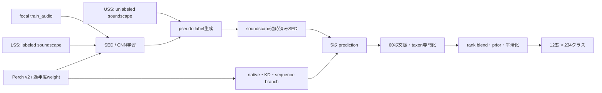
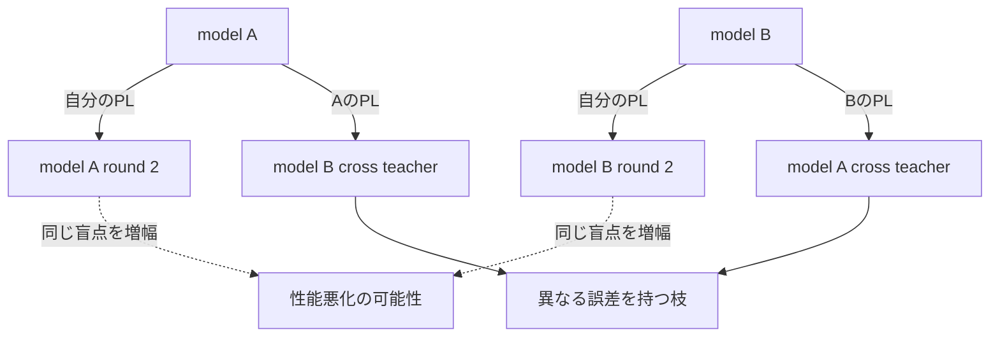
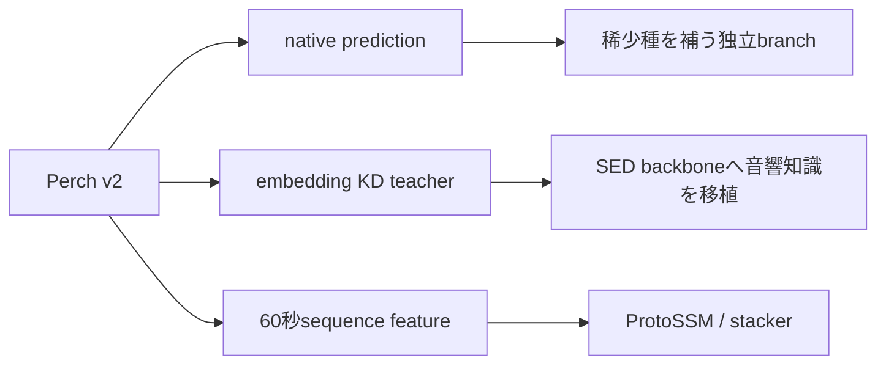

# BirdCLEF+ 2026 上位解法まとめ — 「鳥の分類」より先に録音環境の差を解く

## はじめに

ブラジル・パンタナールの録音から鳥や両生類、昆虫などを識別する、[BirdCLEF+ 2026](https://www.kaggle.com/competitions/birdclef-2026) が2026年6月3日まで開催されていました。

上位解法ではEfficientNet、NFNet、RegNet、Transformer、Mambaなど多くのarchitectureが使われています。しかし、17チームのSolutionを横断して見ると、最も大きな差を生んだのはarchitectureではありませんでした。

> **学習時のクリーンなfocal録音と、test時の多種・雑音を含むsoundscapeの差をどう埋めるか。**

Perch v2や過年度backboneで強い音響表現を作り、unlabeled soundscapeへ擬似ラベルを付け、短い鳴き声と持続音を分けて扱い、最後に異質な予測をrank空間で統合する。この流れが上位の共通骨格でした。

この記事では、最終1〜18位のうち一次Solutionを取得できた17チームを、順位別ではなく実際のpipeline順に整理します。15位の一次SolutionはKaggle CLIで取得できたDiscussion内では確認できなかったため、解法を推測して補っていません。

## コンペ概要

### タスク

testはパンタナールで収録された約600本の60秒soundscapeです。各録音を5秒×12窓に分け、それぞれの窓について234クラスの存在確率を予測します。

対象は鳥だけではありません。

- Aves（鳥類）
- Amphibia（両生類）
- Mammalia（哺乳類）
- Reptilia（爬虫類）
- Insecta（昆虫）

評価指標は、真陽性が1件もないクラスを除外したmacro ROC-AUCです。クラスごとに予測順位を評価して平均するため、稀少種も頻出種と同じ1クラスとしてscoreへ影響します。

### 提供データ

| データ | 内容 | 解法上の役割 |
|---|---|---|
| `train_audio` | Xeno-canto / iNaturalist由来のfocal録音 | 主な教師データ。比較的cleanだがclip-level weak label |
| LSS | 5秒窓ごとにlabelがある少数のsoundscape | test domainの正解信号、validation、sampling、prior |
| USS | labelなしsoundscape | pseudo-labelingによるdomain adaptation |
| site/hour/month | 録音場所・時刻・季節情報 | 生態的な出現priorとpost-processing |
| taxonomy | class、genus、familyなどの階層 | specialist、階層平滑、稀少種補助 |

全音源は32kHzです。Code CompetitionとしてCPU notebookを90分以内、GPU・networkなしで完走させる必要がありました。

### このコンペが難しい理由

- trainの中心は対象種が主役のcleanなfocal録音、testは多種・遠距離・背景雑音を含むPAM soundscape
- LSSが数十file程度と少なく、信頼できるvalidationを作りにくい
- 234クラスの不均衡が大きく、LSSに出現しない稀少種もある
- 鳥の短いevent音と昆虫・両生類の持続的texture音が混在する
- sonotypeはisolated focal例がなく、5秒窓だけではグループ内を区別しにくい
- CPU 90分内で複数model、TTA、長時間文脈を処理する必要がある

## 上位解法の全体像



上位の差は、主に次の5点にありました。

1. focalとsoundscapeのgapをどう埋めたか
2. Perchや過年度weightをどこへ使ったか
3. 5秒より長い文脈とtaxon差をどう扱ったか
4. 似たmodelを増やさず、どう多様性を作ったか
5. noisyなvalidationとCPU 90分の中で何を採用したか

## 1. focal録音とsoundscapeの差を埋める

### trainとtestでは「音の世界」が違う

`train_audio`では、録音者が狙った種が比較的明瞭に入っています。一方、testのPAM録音では次のものが同時に現れます。

- 遠距離で小さな鳴き声
- 複数種の重なり
- 風、雨、機器noise
- 長時間続く昆虫や両生類
- 録音者が対象を選ばない背景音

したがってfocalだけで高精度に分類できても、testと同じ音響条件を学んだことにはなりません。

### pseudo-labelingが最大の一手だった

多くの上位チームは、学習済みmodelでUSSへsoft labelを付け、そのsoundscapeを再学習へ戻しました。

[17位 BUET_Perceptron](https://www.kaggle.com/competitions/birdclef-2026/discussion/708839)は、最初のpseudo-label roundだけで絶対約+3ポイントを報告しています。著者は、他の複雑な工夫をすべて足しても、この1ステップの半分に満たなかったと振り返っています。

[8位 kazumax](https://www.kaggle.com/competitions/birdclef-2026/discussion/704770)の段階表でも、Privateは次のように伸びています。

| 段階 | Private |
|---|---:|
| Baseline | 0.92496 |
| + Perch distillation | 0.94070 |
| + pseudo-label | 0.94875 |
| + 60秒stacker | 0.95675 |

[13位 riesentots](https://www.kaggle.com/competitions/birdclef-2026/discussion/704276)は公開pseudo-labelを使うだけで、HGNetのPublicが0.881から0.934へ改善しました。

これらの結果を見ると、pseudo-labelingは単なるdata追加ではなく、**modelを実際のtest録音条件へ適応させる処理**だったと考えるのが自然です。

### 反復すればするほど良いわけではない

pseudo-labelはmodel自身の誤りも教師にします。そのため、同じmodel familyで反復すると盲点まで強化されます。

[1位 Nikita Babych](https://www.kaggle.com/competitions/birdclef-2026/discussion/704752)のPublicは、0.935→0.946→0.950と2 roundまで伸びましたが、3 round目は0.949へ低下しました。

[2位 tennogh](https://www.kaggle.com/competitions/birdclef-2026/discussion/704399)もround 4までは伸びた一方、round 5でPublic/Privateとも悪化しています。

[17位](https://www.kaggle.com/competitions/birdclef-2026/discussion/708839)ではsame-familyの2巡目で、4 backbone中3つが-0.1〜-0.6ポイント悪化しました。そこで別backboneが作ったpseudo-labelを交換する`cross-mutation`へ切り替えています。



### 1位はpseudo-labelの「量」と「混ぜ方」を直した

1位ではPerch蒸留とLSSでbase modelが強くなり、素朴なpseudo-label追加は逆効果になりました。そこで次のように注入方法を変えています。

- pseudo-labelのlabel massをfocal labelより小さく制限
- LSSとpseudo-labelを同一sampleへ重ねず、別sampleとして非重複注入
- LSS injectorのlabel和を0.5へ正規化して過学習を抑制
- Site 22ではLSS外の種をmask

Gold圏の共通recipeを入れた後は、「どのデータを使うか」より、異なる教師信号を衝突させずに入れる運用が差になりました。

### waveform MixUpもdomain adaptationになる

[9位 Yannan Chen](https://www.kaggle.com/competitions/birdclef-2026/discussion/704887)はfocal録音同士を生波形でMixUpし、1つの大きな音と1つの小さな音を重ねてsoundscapeを模擬しました。少数のLSSはmixのanchorとして保持し、cleanなtest-domain signalを薄めない設計です。

[16位 goonew](https://www.kaggle.com/competitions/birdclef-2026/discussion/704689)は距離減衰、残響、EQを使ったbackground bedでPAM録音を模擬しました。[17位](https://www.kaggle.com/competitions/birdclef-2026/discussion/708839)もfocalとpseudo soundscapeを生波形で50/50に混ぜています。

方法は違っても、目的はすべて`clean foreground → noisy multi-species soundscape`の橋渡しです。

## 2. Perchと過年度weightで音響表現を作る

### Perch v2は1つのmodelではなく3つの使い方があった

Perch v2はGoogle/Cornellのbioacoustic foundation modelで、5秒音声から1536次元embeddingと生物種のlogitを出します。上位では次の3用途に分かれました。



| 使い方 | 何をするか | 主な価値 |
|---|---|---|
| native | Perchのlogitや線形headを直接使う | LSSに現れない稀少種とCNNとの多様性 |
| distillation | SED embeddingをPerch embeddingへcosine/MSEで近づける | 競技dataだけでは得にくいbioacoustic表現 |
| sequence | 12×5秒のembeddingをMamba/Transformerへ入力 | 60秒の持続音と周辺文脈 |

[8位](https://www.kaggle.com/competitions/birdclef-2026/discussion/704770)ではPerch distillationだけでPrivate +0.01574でした。[4位 BirdCLEF+ 2026 Team🤗🤗🤗](https://www.kaggle.com/competitions/birdclef-2026/discussion/704309)は、distilled SEDへPerch由来pseudo-labelを使いPublic 0.934→0.942としています。

一方、Perchは常に最終ensembleへ入れるべきとは限りません。[2位](https://www.kaggle.com/competitions/birdclef-2026/discussion/704399)ではKDにより単体が約+0.02改善しましたが、model間相関も増えたため、自作branchではあえて蒸留を外して多様性を残しました。

### 過年度のXeno-canto weightも強かった

2025年上位解法、特にXeno-cantoで学習されたEfficientNetV2-Sのweightが広く使われました。

- [9位](https://www.kaggle.com/competitions/birdclef-2026/discussion/704887): 少なくともPublic約+0.01
- [12位 Bobbing Redstart](https://www.kaggle.com/competitions/birdclef-2026/discussion/704404): 自前XC pretrainingで約+0.01
- [13位](https://www.kaggle.com/competitions/birdclef-2026/discussion/704276): 過年度weightが約+0.007級

逆に、自前の大規模pretrainingが公開weightへ勝てない例も多くありました。

- [4位](https://www.kaggle.com/competitions/birdclef-2026/discussion/704309): 自前814k XC pretrainが2025公開weightより一貫して悪化
- [9位](https://www.kaggle.com/competitions/birdclef-2026/discussion/704887): 代替backboneの自前pretrainingが不発
- [13位](https://www.kaggle.com/competitions/birdclef-2026/discussion/704276): 自前XC pretrainが改善せず

data量だけでなく、frontend、sampling、taxonomy、training recipeまで含むlineageが重要でした。

### Perchなしでも金圏へ行けた

[11位 Oh Captain! My Captain!](https://www.kaggle.com/competitions/birdclef-2026/discussion/704264)はGPU故障によりPerchを使えず、480-mel・20秒のEfficientNet familyを採用しました。Stage1の未提出modelはPrivate 0.959で3位相当でした。

[12位](https://www.kaggle.com/competitions/birdclef-2026/discussion/704404)もPerchを使わず、data repair、class-wise Asymmetric Loss、MixMax consistency、sliding TTAでPrivate 0.95581へ到達しています。

foundation modelは強力ですが、必須条件ではありません。高解像度frontend、localization、data quality、consistency regularizationで別の勝ち筋を作れます。

## 3. 5秒の鳴き声をどうmodel化するか

### SED headでweak labelと短いeventをつなぐ

focal録音は長いclip全体にlabelが付く一方、評価単位は5秒です。そのため上位のCNN系では、時間方向のframe predictionとclip predictionを同時に持つSED headが標準的でした。

典型的な構成は次のとおりです。

1. waveformからlog-mel spectrogram
2. 2D CNNで時間×周波数featureを抽出
3. 周波数方向をGeMやaverageでpooling
4. frame logitとattention/clip logitを計算
5. clip BCEとframe-max BCEなどを共同学習

[18位 Win or lose?](https://www.kaggle.com/competitions/birdclef-2026/discussion/704287)は`0.5·BCE(clip) + 0.5·BCE(max_frame)`を使用しました。短い鳴き声をframe maxで拾いながら、clip labelも利用する設計です。

### mel設定はbackboneと同じくらい効く

[7位 空飛ぶ宝石](https://www.kaggle.com/competitions/birdclef-2026/discussion/704292)は`n_mels=128, hop=320, fmin=50, fmax=16000`へ調整し、pseudo-labelなしで約0.92から約0.94まで改善しました。

[11位](https://www.kaggle.com/competitions/birdclef-2026/discussion/704264)は480 mel、`n_fft=4096`、`hop=1001`とし、20秒を約20 temporal frame、つまり1秒ごとのpredictionとして扱いました。

pretrained backboneを使っても、入力表現の周波数分解能と時間分解能がtaskへ合わなければ性能は出ません。

### 5秒・10秒・20秒は役割が違う

| 窓長 | 向いている音 | 代表例 |
|---|---|---|
| 5秒 | 短いbird event、評価窓との直接対応 | 1〜4位、12位、18位など |
| 10秒 | 前後文脈、複数event、MixUpの安定 | 7位、9位、16位など |
| 20秒 | 持続するtexture、1秒frame prediction | 10位、11位、14位など |

[9位](https://www.kaggle.com/competitions/birdclef-2026/discussion/704887)ではclass-interaction moduleは5秒だけでは効かず、10秒を2分割する構成と組み合わせるとPublic 0.939→0.952へ改善しました。

[14位 Dieter](https://www.kaggle.com/competitions/birdclef-2026/discussion/704864)も、20秒文脈が5秒独立より一貫して良かったと報告しています。

### augmentationは物理的に正しいとは限らない

[5位 Jiacheng Ma](https://www.kaggle.com/competitions/birdclef-2026/discussion/704602)は、本来加減算すべきdB領域でgainを乗算するFilterAugの誤実装が約+0.01だったと報告しています。

物理的には不自然でも、modelから見ると強いspectral regularizationとして働きました。ただし「バグだから効く」のではなく、固定seedと複数条件で再現できるかを確認する必要があります。

[12位](https://www.kaggle.com/competitions/birdclef-2026/discussion/704404)はlabelを線形補間せずmaxで混ぜるMixMaxを使用しました。音Aか音Bのどちらかに種が存在すれば、混合音にも存在するという音響taskに自然なlabel ruleです。CASLとMixMaxは単独では弱く、pretrainingと組み合わせてBCE baseline Private 0.917から0.940へ伸びました。

## 4. data qualityを上げる

上位の主流は公開weightとpseudo-labelでしたが、人手やdata repairで独自性を作ったteamもあります。

### multi-label focal録音を5秒粒度へ直す

[7位](https://www.kaggle.com/competitions/birdclef-2026/discussion/704292)は、長いclipに1 labelしか付いていない4,000件超のmulti-label focal録音を人手で確認し、共起種を5〜10秒粒度で再ラベルしました。全体の約10%に相当します。

さらにtaxonomyの学名不一致やPerch側のclass mappingも修正しました。標準的なSED + distillationを、label qualityで独自branchへ変えた解法です。

### 壊れた録音と重複を直す

[12位](https://www.kaggle.com/competitions/birdclef-2026/discussion/704404)は次のdata repairを行いました。

- 1秒noiseだけになっていた369録音を元URLから復元
- hash重複した86 unique録音を除去
- 背景種が混入する区間を手動trim
- silent soundscapeをhard negativeとして反復採掘
- taxonomy synonymを追加

label cleaningを全dataへ広く行うのではなく、破損、重複、taxonomy mismatch、高損失clusterへ絞った点が重要です。

## 5. 5秒を超える文脈とtaxon差を使う

### event音とtexture音は同じではない

鳥の鳴き声は短いonsetを持つeventであることが多い一方、昆虫や両生類は長く続くtextureとして現れます。

| 性質 | event系 | texture系 |
|---|---|---|
| 代表 | 鳥、哺乳類、一部爬虫類 | 昆虫、両生類 |
| 時間構造 | 短い鳴き声、間欠的 | 持続音、連続的 |
| 有効な処理 | 短窓、frame max、狭い平滑 | 長窓、広い平滑、60秒文脈、site/hour prior |

全234クラスへ同じwindow、teacher、smoothingを使うと、どちらかに不利になります。

### 60秒sequenceを読む

ProtoSSM系は、12×5秒のPerch embeddingをMambaなどのstate-space modelへ入力し、60秒全体をmodel化します。

- [5位](https://www.kaggle.com/competitions/birdclef-2026/discussion/704602)、[7位](https://www.kaggle.com/competitions/birdclef-2026/discussion/704292): 自作または派生ProtoSSMを独立branchとして追加
- [14位](https://www.kaggle.com/competitions/birdclef-2026/discussion/704864)、[17位](https://www.kaggle.com/competitions/birdclef-2026/discussion/708839)、[18位](https://www.kaggle.com/competitions/birdclef-2026/discussion/704287): Perch embedding、site/hour、prototypeを系列処理
- [16位](https://www.kaggle.com/competitions/birdclef-2026/discussion/704689): 公開ProtoSSMと異質なSED枝を融合

[8位](https://www.kaggle.com/competitions/birdclef-2026/discussion/704770)は明示的な2段stackingを採用しました。base SEDのlogitとembedding、site/hour prior、前後窓のlogitをGRU/LSTMとLightGBM/XGBoostへ入力し、Private +0.008を得ています。

より強い5秒modelを作るだけでなく、5秒predictionを素材として次のmodelへ渡す発想です。

### taxon specialistを作る

[2位](https://www.kaggle.com/competitions/birdclef-2026/discussion/704399)のInsecta specialistはPublic +0.002、ensemble weightを高くすると+0.004でした。

[14位](https://www.kaggle.com/competitions/birdclef-2026/discussion/704864)はteacherもblendもtaxon別に変えています。最終blendはAvesでSED 0.9 / Proto 0.1、non-Avesで0.5 / 0.5でした。

[1位](https://www.kaggle.com/competitions/birdclef-2026/discussion/704752)はAmphibia/Insecta専門家に加え、speciesを区別できない場合もgenus信号を共有するgenus modelで約+0.001〜0.002を報告しています。

### priorとsmoothingもtaxon別にする

site、hour、monthは「この場所・時刻・季節にその種が存在し得るか」を表します。[10位 coolz](https://www.kaggle.com/competitions/birdclef-2026/discussion/704271)はPerch SED Transformerの後にsite/hour/site-hour、昼夜、Amphibiaの月prior、taxon別平滑を適用しました。

[12位](https://www.kaggle.com/competitions/birdclef-2026/discussion/704404)では2.5秒sliding TTAがPrivate 0.9418→0.9517、taxon smoothingで0.9560まで改善しました。

ただしpriorはbase modelが強くなると逆効果になる場合があります。9位ではsite/hour priorが途中から悪化し、12位でもprior追加はPublic 0.9588→0.9595に対してPrivate 0.9560→0.9558でした。

## 6. 異質なmodelをrank空間で混ぜる

### probability平均ではscaleが合わない

SEDのsigmoid、Perchのlogit、ProtoSSM、GBMではpredictionの分布が異なります。評価がROC-AUCなら、必要なのは各class内の順序です。

そこで多くのteamが、modelごと・classごとに全rowをpercentile rankへ変換してから平均しました。

```text
model prediction
    ↓ class-wise percentile rank
0〜1で共通scale化
    ↓ weighted / equal average
final class ranking
```

[1位](https://www.kaggle.com/competitions/birdclef-2026/discussion/704752)はfine-tuned model群とPerch nativeをrank変換し、0.8 / 0.2で融合しました。[17位](https://www.kaggle.com/competitions/birdclef-2026/discussion/708839)はSED 0.6 / Perch 0.4です。[18位](https://www.kaggle.com/competitions/birdclef-2026/discussion/704287)は128/256-mel SEDとPerch/ProtoSSMの3枝を等重みrankで混ぜました。

[14位](https://www.kaggle.com/competitions/birdclef-2026/discussion/704864)はrankではなくclass-wise histogram matchingでProtoSSMの分布をmain SEDへ合わせています。方法は違っても、異なる枝のcalibrationを揃えてから融合する考え方は同じです。

### 多様性はbackbone名よりlineageから生まれる

本当に異質なbranchを作る軸は次のとおりです。

- native Perchかdistilled SEDか
- teacher modelは何か
- focal / LSS / USSのsampling比
- 5秒・10秒・20秒
- mel frontend
- BCE、soft AUC、ASLなどのloss
- 5秒独立か60秒sequenceか
- species、genus、taxonのlabel space

[3位 kapenon](https://www.kaggle.com/competitions/birdclef-2026/discussion/704420)はmel、backbone、学習recipeの異なる3モデルを0.4 / 0.2 / 0.4で融合しました。[16位](https://www.kaggle.com/competitions/birdclef-2026/discussion/704689)は公開Perchへ、source-balanced Focal BCEのEfficientNetV2-Sとsoft AUCのNFNetを追加しています。

### model数はensemble品質ではない

[18位](https://www.kaggle.com/competitions/birdclef-2026/discussion/704287)では4本目のNFNetを追加するとPrivateが0.957から0.955へ悪化し、3モデルが最良でした。

[2位](https://www.kaggle.com/competitions/birdclef-2026/discussion/704399)では強いKD modelを相関の高さから外しました。[13位](https://www.kaggle.com/competitions/birdclef-2026/discussion/704276)もPerch distillationを切り、公開Perchとは違う誤差を持つ自作SEDを残しています。

単体scoreではなく、既存ensembleへ足したときのmarginal gainでbranchを評価する必要があります。

## 7. 信頼できるCVがない中で選ぶ

LSSはtest domainに近い唯一の正解dataですが、file数が少なく、siteやclassの偏りも大きいため、1つのCVでmodelを安定して順位付けできませんでした。

### PublicとPrivateが逆方向へ動く

具体的な反例が多く報告されています。

- [9位](https://www.kaggle.com/competitions/birdclef-2026/discussion/704887): 複雑な本提出Private 0.956より、事後の素のEffNet 2本が0.958
- [11位](https://www.kaggle.com/competitions/birdclef-2026/discussion/704264): 未提出Stage1がPrivate 0.959で3位相当、最終は0.95599
- [12位](https://www.kaggle.com/competitions/birdclef-2026/discussion/704404): priorでPublic改善、Private微悪化
- [17位](https://www.kaggle.com/competitions/birdclef-2026/discussion/708839): V2S cross teacherがPublic +1.1pt、Private -0.3pt
- [18位](https://www.kaggle.com/competitions/birdclef-2026/discussion/704287): taxon smoothingがPublic -0.0005、Private +0.002

Public LBへ細かいweight、threshold、priorを合わせるほど、Privateで反転する自由度が増えます。

### validationは1つのscoreより診断viewにする

上位では次のような複数viewが使われました。

- Site 22を分離し、未知siteへの汎化を見る
- species coverageを最大化したsplit
- LSS file単位のGroupKFold
- Aves / non-Aves / sonotype別AUC
- 複数seedのmedianとvariance
- branch間のprediction相関

[1位](https://www.kaggle.com/competitions/birdclef-2026/discussion/704752)はSite 22 splitとspecies coverage splitの2本を使用しました。[16位](https://www.kaggle.com/competitions/birdclef-2026/discussion/704689)はLSS predictionのSpearmanとmulti-seedで候補を整理しています。

「正しい順位を出すCV」を1つ作るより、どのtaxon、site、seedで壊れたかを説明できる診断系として使う方が現実的でした。

## 8. CPU 90分へensembleを収める

音響modelを増やすと、waveform decode、mel spectrogram、CNN inferenceが繰り返されます。上位ではOpenVINOやONNXだけでなく、同じ計算を共有する設計が使われました。

### melを1回だけ計算する

[6位 Sinan Calisir](https://www.kaggle.com/competitions/birdclef-2026/discussion/704949)は、waveform入力からlog-melを1回だけ計算し、複数submodelへ分岐する単一OpenVINO graphを作りました。これにより7〜8分を短縮しています。

浮いた時間は単なる余裕ではなく、別backboneやfoldを追加する予算になります。

### modelをCPU laneへ割り当てる

[4位](https://www.kaggle.com/competitions/birdclef-2026/discussion/704309)はKaggleの4 vCPUを2 vCPU×2 laneとして扱い、OpenVINO/ONNXの5モデルを動的に配置しました。

[8位](https://www.kaggle.com/competitions/birdclef-2026/discussion/704770)や[14位](https://www.kaggle.com/competitions/birdclef-2026/discussion/704864)はProtoSSMを推論時に学習せず、事前生成したartifactをloadしました。

90分制約では、frontend共有、model変換、artifact cacheまで含めてensemble architectureです。

## 上位解法から見えた、特に重要な発見

### 1. domain gapを埋める方がarchitecture変更より先

17位の約+3ポイント、8位のPrivate +0.008、13位の0.881→0.934が示すように、USS pseudo-labelは多くのarchitecture変更より大きく効きました。

### 2. pseudo-labelには停止条件が必要

1・2・17位でlate roundが悪化しました。round数を増やすのではなく、teacher lineage、label mass、clean labelとの混ぜ方を管理する必要があります。

### 3. foundation modelの価値は単体scoreだけではない

Perchはnative prediction、distillation teacher、sequence featureという異なる役割を持ちました。LSS外の稀少種を補い、CNNとは違う誤差を作ることがensemble価値でした。

### 4. class groupごとに世界が違う

鳥の短いeventと昆虫・両生類のtextureでは、window、teacher、smoothing、priorの最適値が違います。taxonを単なるlabel groupでなく、別の音響taskとして扱う必要があります。

### 5. Gold圏ではdataと運用が独自性になる

公開Perch、過年度weight、pseudo-labelが共通化した後、1位の注入制御、7位の手動再ラベル、12位のdata repair、6位の推論共有のような地味な差が順位を分けました。

## うまくいかなかったアプローチ

- **pseudo-labelを無制限に反復**: 1位は3 round目、2位は5 round目、17位はsame-family 2巡目で悪化
- **hard pseudo-label**: 6位ではsoft labelより悪化
- **自前pretrainingをdata量だけで強くする**: 4・9・13位で公開domain weightに負けた
- **強い単体modelを無条件に追加**: 2位のKD枝、18位の4本目NFNetはensemble gainを生まなかった
- **全modelへ同じpost-process**: 5位では一律適用が逆効果
- **base強化後も古いpriorを残す**: 9・12位でPublicだけ改善、または途中から悪化
- **model数を多様性と数える**: 同じteacher、PL、frontend由来のbranchは同じ場所で間違える
- **Publicへ多数の自由度をfit**: 17位ではPublic +1.1ptがPrivate -0.3ptへ反転
- **複雑なfinalだけを残す**: 9位のraw 2本、11位の中間Stageが事後Privateで本提出を上回った

上位Solutionで失敗したのは、個々の手法が常に悪いからではありません。強くなったbase、teacher相関、taxon、runtime、validationの条件が変わったのに、以前のrecipeをそのまま残したときに悪化しています。

## まとめ

BirdCLEF+ 2026の上位解法は、次の流れとして整理できます。

1. 過年度weightやPerchで強い音響表現を作る
2. focal、LSS、USSの役割を分ける
3. pseudo-labelやwaveform MixUpでsoundscapeへ適応する
4. SEDで5秒のeventを捉え、必要なら10〜20秒・60秒文脈を追加する
5. event/texture、Aves/non-Aves、sonotypeで専門化する
6. calibrationの違うbranchをrankやhistogramで統合する
7. raw predictionを残し、priorとsmoothingをtaxon別に検証する
8. frontend共有とOpenVINO/ONNXで90分へ収める

このコンペから持ち帰りたいのは、特定のEfficientNetやPerch notebookではありません。

> **trainとtestの生成過程が違うなら、model選択より先にそのgapを特定する。target-like dataで適応し、反復には停止条件を置き、単体scoreではなく異なる誤差を持つbranchを作る。class groupの性質と推論制約まで含めてpipelineを設計する。**

音声以外でも、撮影機器の異なる画像、施設の異なる医療data、時期の異なるtable data、生成元の異なる文章など、train/testの生成過程がずれるtaskに通じる考え方です。

## 参照した上位Solution

1. [1st Place — Nikita Babych](https://www.kaggle.com/competitions/birdclef-2026/discussion/704752)
2. [2nd Place — tennogh](https://www.kaggle.com/competitions/birdclef-2026/discussion/704399)
3. [3rd Place — kapenon](https://www.kaggle.com/competitions/birdclef-2026/discussion/704420)
4. [4th Place — BirdCLEF+ 2026 Team🤗🤗🤗](https://www.kaggle.com/competitions/birdclef-2026/discussion/704309)
5. [5th Place — Jiacheng Ma](https://www.kaggle.com/competitions/birdclef-2026/discussion/704602)
6. [6th Place — Sinan Calisir](https://www.kaggle.com/competitions/birdclef-2026/discussion/704949)
7. [7th Place — 空飛ぶ宝石](https://www.kaggle.com/competitions/birdclef-2026/discussion/704292)
8. [8th Place — kazumax](https://www.kaggle.com/competitions/birdclef-2026/discussion/704770)
9. [9th Place — Yannan Chen](https://www.kaggle.com/competitions/birdclef-2026/discussion/704887)
10. [10th Place — coolz](https://www.kaggle.com/competitions/birdclef-2026/discussion/704271)
11. [11th Place — Oh Captain! My Captain!](https://www.kaggle.com/competitions/birdclef-2026/discussion/704264)
12. [12th Place — Bobbing Redstart](https://www.kaggle.com/competitions/birdclef-2026/discussion/704404)
13. [13th Place — riesentots](https://www.kaggle.com/competitions/birdclef-2026/discussion/704276)
14. [14th Place — Dieter](https://www.kaggle.com/competitions/birdclef-2026/discussion/704864)
15. [16th Place — goonew](https://www.kaggle.com/competitions/birdclef-2026/discussion/704689)
16. [17th Place — BUET_Perceptron](https://www.kaggle.com/competitions/birdclef-2026/discussion/708839)
17. [18th Place — Win or lose?](https://www.kaggle.com/competitions/birdclef-2026/discussion/704287)
